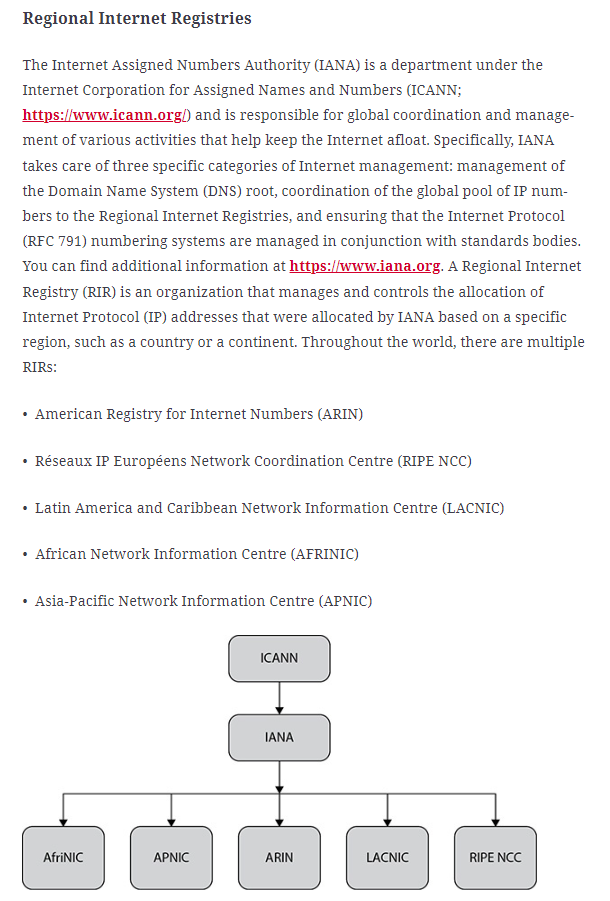
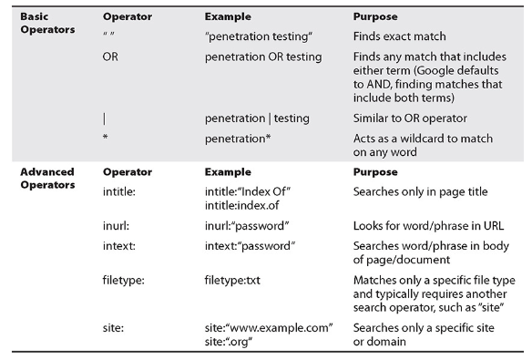

# Chapter 1       Planning and Preparation
## PTES
http://www.pentest-standard.org/index.php/PTES_Technical_Guidelines
http://www.pentest-standard.org/index.php/Pre-engagement#Questionnaires

## Pre-Engagement Documentations
1. “Get Out of Jail Free” Card
2. Statement of Work
3. Nondisclosure Agreement
4. Third-Party Providers
- If testing Microsoft Azure or Google Cloud assets for a client, clearly state in the RoE and any legal documentation that you are acting on behalf of your client and that the client has authorized you to evaluate assets hosted with the third-party provider.
- If testing one or more Amazon AWS services, verify that each service you are testing is one of the eight services exempt from notification. A list of current exempt services can be found here: https://aws.amazon.com/security/penetration-testing/. If a particular service is not included in the list, send an e-mail to the alias listed on the page with a description of the type of test you’d like to perform. Clearly state in the RoE and any legal documentation that you are acting on behalf of your client and the client has authorized you to evaluate assets hosted with a third-party provider.

# Chapter 2       Reconnaissance
## Collaboration tools
1. Media wiki - https://www.mediawiki.org
2. Github wiki
3. Dradis Framework - https://dradisframework.com
- https://dradis.com/ce/documentation/install_kali.html
- https://www.youtube.com/watch?v=IVcep2P2T2U

## Discovery Methods
There are quite a few open source discovery methods available to pentesters that offer varying services and capabilities. This section discusses the following discovery methods that you will likely encounter on the GPEN examination:
- Regional Internet Registries (RIRs)  

- WHOIS databases and searches
  - https://www.internic.net/whois.html
  - https://lookup.icann.org
- Querying DNS records
```
A       - Address mapping record; stores hostname and IPv4 address
AAAA    - IPv6 address record; stores hostname and IPv6 address
CNAME   - Canonical name record; alias that points to another hostname
NS      - Name server record; identifies an authoritative name server
MX      - Mail exchanger record; specifies an SMTP mail server
PTR     - Reverse-lookup pointer record; provides the hostname for a given IP address
CERT    - Certificate record; stores encryption certificates (e.g., PKIX, PGP, etc.)
SRV     - Service location record; similar to MX but for other protocols
TXT     - Text record; human-readable data such as account information, server, network, or data center information
SOA     - Start of authority record; administrative information about a DNS zone
```
- DNS Cache Snooping
```
nslookup -norecurse -type=A google.come 192.168.1.50
```
- DNS Zone Transfer
```
dig @[name server] [domain name] [record type]
dig +nocomments @192.168.1.50 lab.local MX
dig +nocomments @192.168.1.50 lab.local -t AXFR    //anonymous zone transfer
```

- Search engines

1. shodan
2. censys
```
- IPv4 hosts https://censys.io/ipv4
- Websites https://censys.io/domain
- Certificates https://censys.io/certificates
```
- OSINT collection tools
1. OSINT Framework - https://osintframework.com/
2. Recon-ng - 
- Metadata analysis


# Chapter 3       Initial Access
## Ping Sweeping
```bash
notroot@host:~$ for i in `seq 1 254`; do ping -c 1 192.168.1.$i | grep "bytes from" 2>&1>/dev/null && echo "192.168.1.$i is up";done
```
```cmd
C:\> for /L %I in (1 1 254) DO @ping -n 1 -w 5 192.168.1.%I | findstr "Reply from" > NUL && @echo 192.168.1.%I is up
```

## fakeSyslog.py
```
#!/usr/bin/env python3
# Usage statement
# usage: fakeSyslog.py target user
# Import our libraries
from scapy.all import *
import time
# Define our variables
tgt = sys.argv[1]
user = sys.argv[2]

myTime = time.strftime("%b %d %H:%M:%S")
myPri = 85
ip = IP (dst=tgt)
udp = UDP (dpot=514, sport=45679)
myMsg = " pam_unix(sshd:auth) : authentication failure; logname= uid=0 euid=0 tty=ssh ruser= rhost=::1  " +  "user=" + user
raw=Raw(load="<" + str(myPri) + ">" + myTime + myMsg)

# Assemble our packet
p = ip/udp/raw

# Send our packet
send(p,verbose=0)
```

# Chapter 4       Execution


# Chapter 5       Persistence, Privilege Escalation, and Evasion


# Chapter 6       Credential Access


# Chapter 7       Discovery and Lateral Movement


# Chapter 8       Data Collection and Exfiltration


# Chapter 9       Writing and Communicating the Pentest Report


# Appendix A    Penetration Testing Tools and References


# Appendix B    Setting Up a Basic GPEN Lab


# Appendix C    Capstone Project


# Appendix D    About the Online Content

## Windows Server 2016
https://www.microsoft.com/en-us/evalcenter/download-windows-server-2016-essentials
Product key: NCPR7-K6YH2-BRXYM-QMPPQ-3PF6X

## Windows 10
https://www.microsoft.com/en-us/evalcenter/download-windows-10-enterprise

## Metasploitable 3
https://github.com/rapid7/metasploitable3

## WinSCP
https://winscp.net/download/WinSCP-6.3.3-Setup.exe/download


# Glossary


# Index

