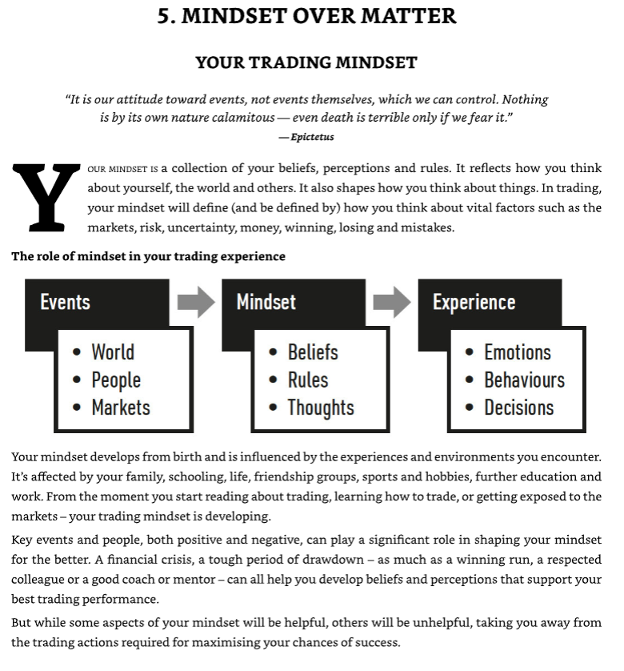
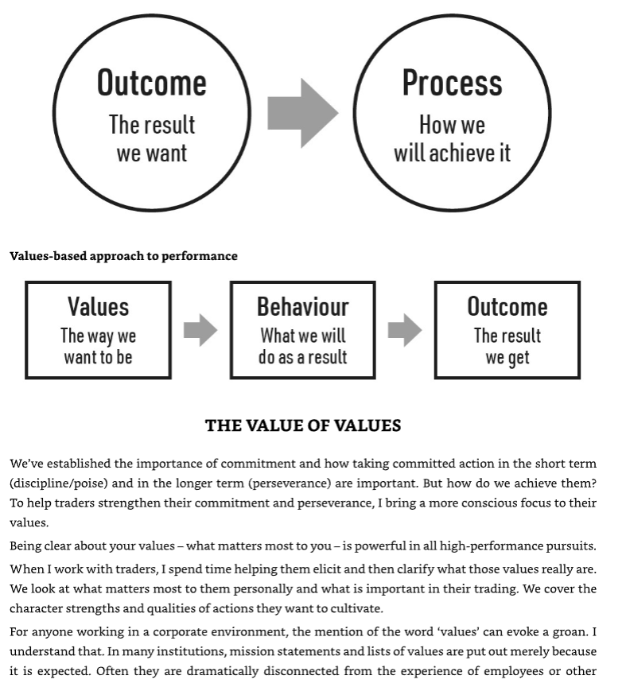
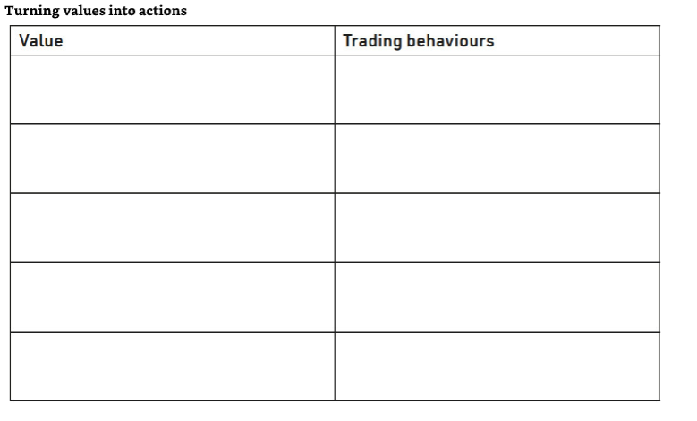

# TABLE OF CONTENTS

## About the Author
## Preface: A Guide to this Book

## Part One: Becoming Bulletproof

1. **Why Bulletproof?**
   - Coaching traders
   - What brings you here?

2. **The Bulletproof Framework**
   - The key requirements
   - The four foundations of bulletproof trading
   - Getting the most from this book
   - A future bulletproof trader: you

## Part Two: Ups and Downs

3. **The Nature of Trading**
   - Trading as a high-performance activity
   - The trading performance environment
   - Ups and downs

4. **Get Good at the Downs**
   - The pain of loss
   - The inner citadel
   - Getting good at the downs

## Part Three: Commitment

5. **Mindset Over Matter**
   - Your trading
   - Getting good at stress
   - Losses, mistakes and setbacks
   - A worthy rival
   - Developing a bulletproof mindset

6. **Take Committed Action**
   - The motivation trap
   - From motivation to commitment
   - Committed action

## Part Four: Risk and Uncertainty

7. **Know Your Values**
   - A different approach
   - The value of values
   - Building patterns of values-based committed action
   - Values, stress and difficulty

8. **Manage Your Risk**
   - Risk, stress and trading decisions
   - The art of optimal risk-taking
   - Risk-aware decision-making

9. **Embrace Uncertainty**
   - Which box?
   - Markets, traders and uncertainty
   - Impermanence
   - Practising uncertainty
   - This is what happens in the bathhouse

10. **Plan for the Worst**
   - Prepare for success
   - What if?
   - If-then
   - The pre-mortem

## Part Five: Focus

11. **Train Your Attention**
   - Attention matters
   - Training attention
   - Attention-training builds present-moment awareness
   - Responding vs reacting
   - The observer

12. **Focus on the Process**
   - Best decision vs worst decision
   - Our obsession with results
   - Process focus

13. **Control the Controllables**
- Uncontrollability, stress and the markets
- The dichotomy of control
- A speedboat driver joins the crew of an oil tanker
- The CIA framework
- With controllability comes responsibility – and response-ability

## Part Six: Discomfort

14. **Get Comfortable With Being Uncomfortable**
- The discomforts of trading
- Aversion and the costs of avoiding discomfort
- The upside of discomfort
- Willingness: exposure in action
- Developing willingness: getting good at discomfort
- Practising willingness and discomfort

15. **Unhook from Difficult Thoughts**
- Thinking about your thinking
- Don’t think of a white bear
- Letting go of the struggle
  1. Awareness
  2. Workability
  3. Defusion
  4. Action

16. **Work With Your Stress-Based Emotions**
- Trading, like life, is emotional
- A trader works with anxiety
- Working with emotions

## Part Seven: Confidence

17. **Build Confidence in Coping With Difficulty**
- What is confidence?
- Demands vs resources
- I can deal with difficult trading situations
- The confidence gap: taking action

18. **Stay Calm in Critical Moments**
- Composure builds confidence
- Putting the brakes on
- Tactical breathing strategies

19. Don't Beat Yourself Up
- Harsh trading critic or compassionate trading coach?
- What is self-compassion?
- The benefits of self-compassion
- Practising self-compassion, enhancing confidence

## Part Eight: Flexibility

20. **Find the Opportunity in the Difficult**
- Negativity bias
- Finding the opportunity
- Learning vs earning
- The view from above
- What would a role model do?

21. **Get Good at Adapting to Change**
- Change is inevitable
- Floored: survival of the most adaptable
- Survival is not mandatory
- The futures lab
- Adapting to new markets effectively

## Part Nine: State Management

22. **Monitor Your Stress and Fatigue Levels**
- The physiology of trading performance
- Fatigue makes cowards of us all
- Stress-induced irrational pessimism
- Objective physiological feedback
- State management

23. **Master the Art of Recovery**
- Adaptive toughness and supercompensation
- Getting the stress–recovery balance right
- What is recovery?
- Switching off to switch on: recovery strategies
- Tactical recovery

24. **Develop Your Physiological Fitness**
- Physical fitness and stress resilience
- Physical activity as stress management
- Trading well
- The physiological platform

## Conclusion

25. **The End – and a Beginning**

## Acknowledgements

## Publishing details

# Notes
## Part One: Becoming Bulletproof
1. Managing Stress
2. Performing under pressure
3. Dealing with setbacks
4. Coping with challenges and change
5. Sustaining performance

### Four Foundations of Bulletproof Trading
1. Psychology
2. Physiology
3. Philosophy
4. Pragmatism

## Part Two: Ups and Downs
1. What are the challenges and demands you face in trading the markets?
- Increasing resilience while working through self-doubt, anger, sadness, regret, etc...from divorce and last year's blowup.
2. What do you need to be good at in order to meet those challenges and demands?
- Dealing with setbacks, Performing under pressuire, Managing Stress, Sustaining performance and Consistency.

## Part Three: Commitment

### Value #1

#### Trading Behaviors

### Value #2

#### Trading Behaviors

### Value #3

#### Trading Behaviors

### Value #4

#### Trading Behaviors

### Value #5

#### Trading Behaviors

## Part Four: Risk and Uncertainty

## Part Five: Focus

## Part Six: Discomfort

## Part Seven: Confidence

## Part Eight: Flexibility

## Part Nine: State Management
