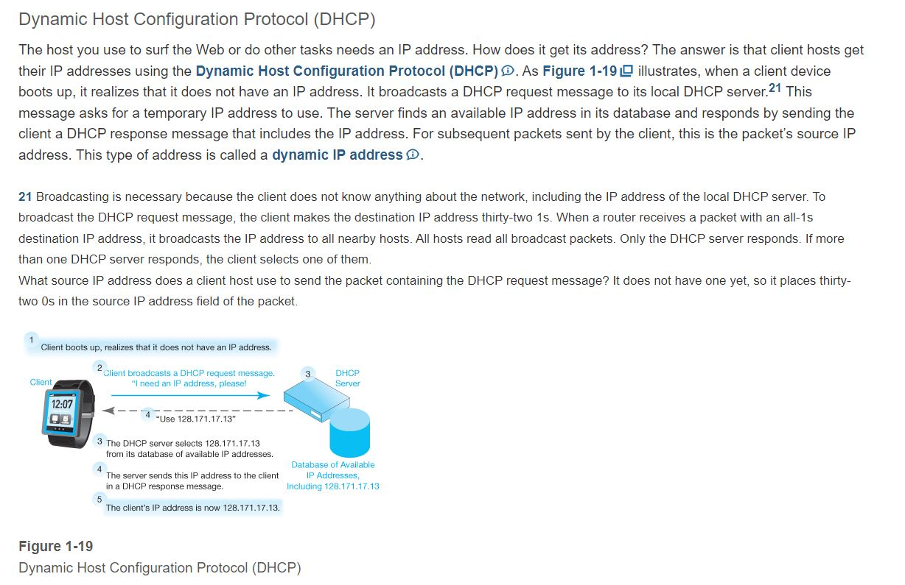
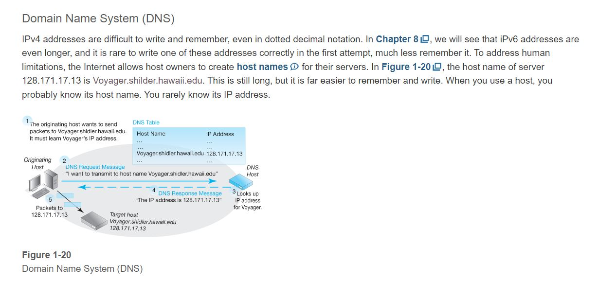
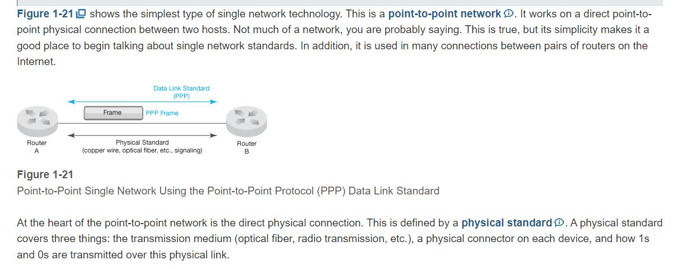
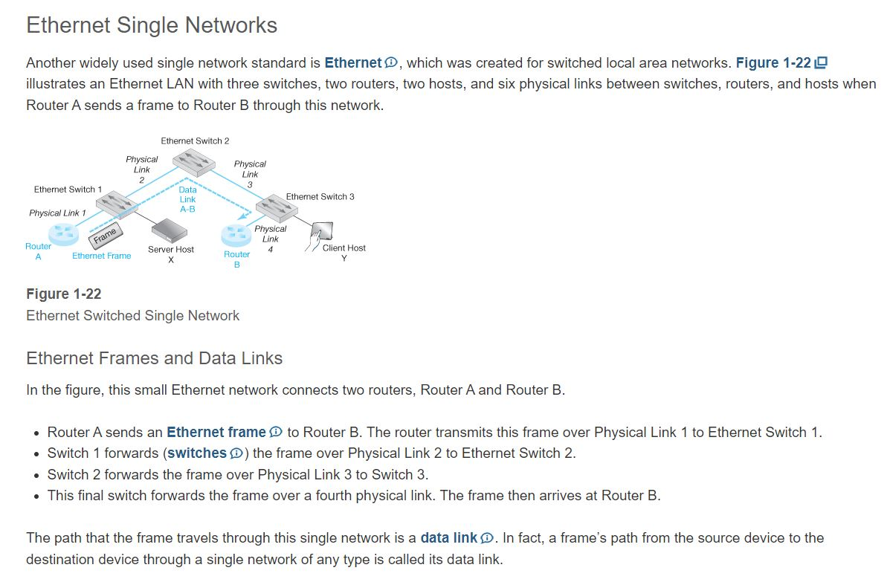
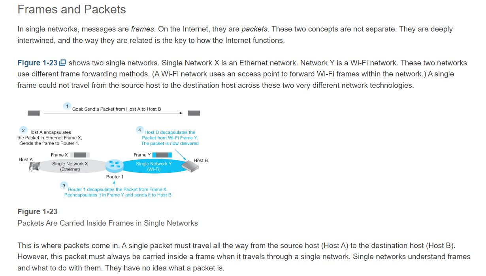
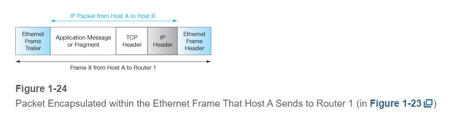
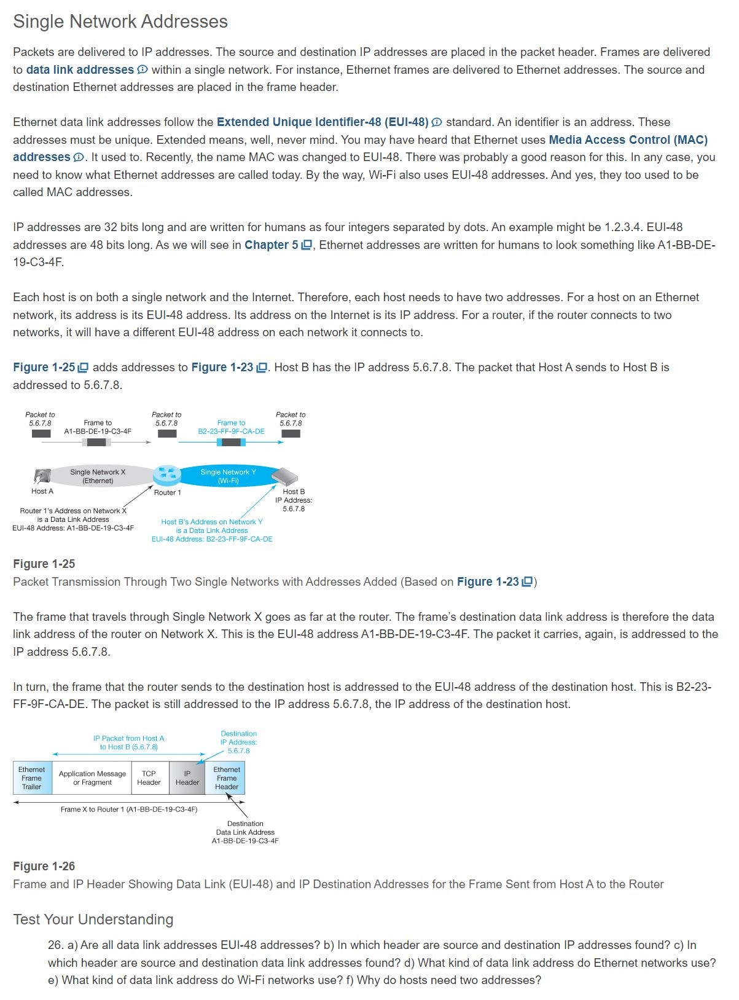
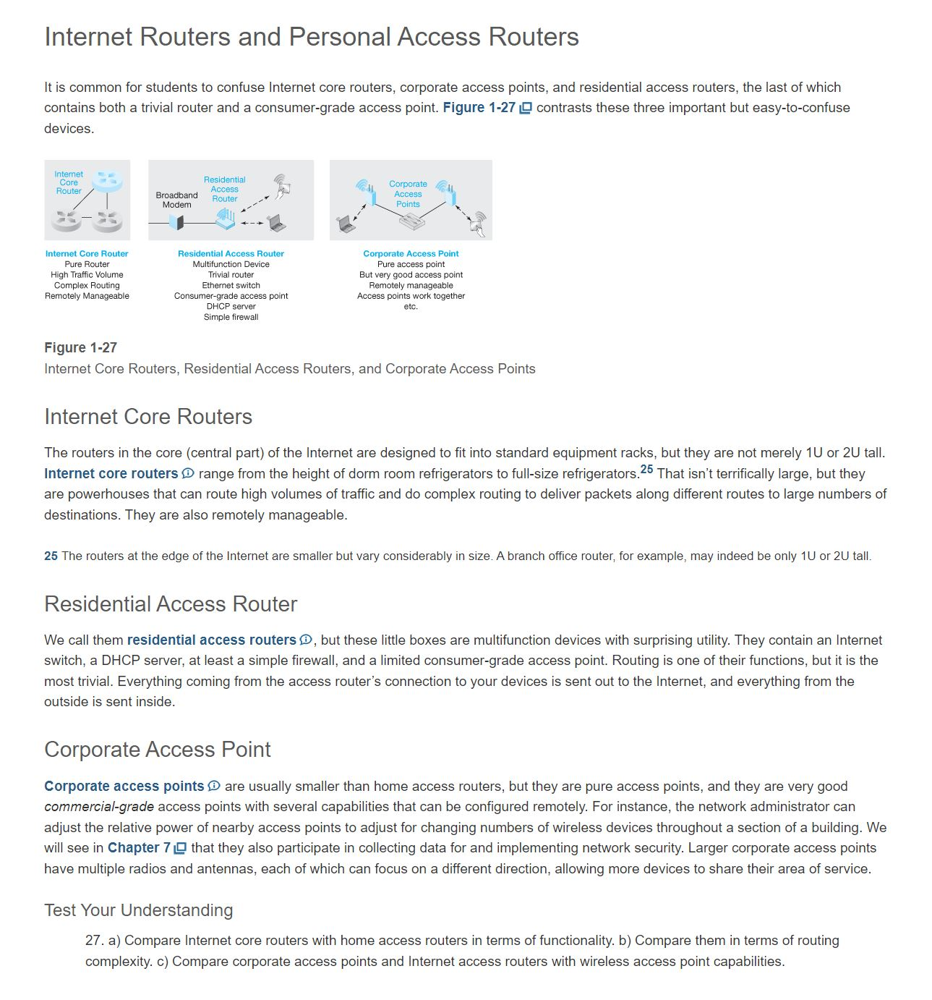
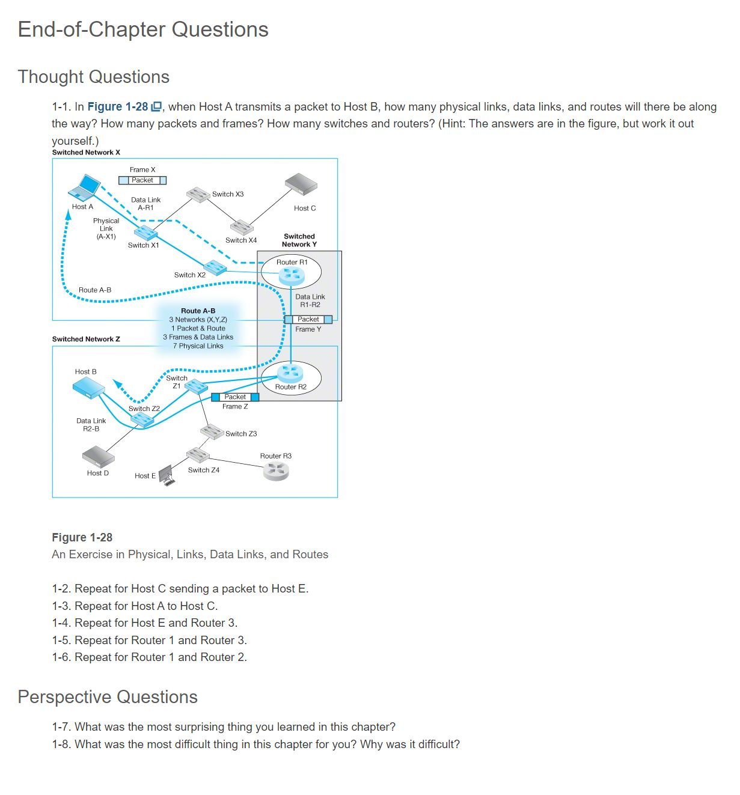

Chapter 1 Core Network Concepts and Terminology

# Learning Objectives
By the end of this chapter, you should be able to:
- Discuss how the Internet is changing and the security challenges these changes are creating.
- Explain basic concepts and terminology for the hosts (devices) that connect to the Internet.
- Explain basic concepts and terminology for the Internet itself.
- Explain basic concepts and terminology for single networks and their role on the Internet.
- Explain the distinctions between Internet routers and personal access routers; explain the differences between personal access routers and wireless access points.

# Rough Notes
## Krebsonsecurity.com
Krebsonsecurity was attacked with record DDoS
Attack was remarkable becuase it used nontraditional devices + IoT

Some default IoT passwords are hardcoded and cannot be changed by the user. The Mirai malware jumped from one device to another by trying a mere 68 device-password combinations.

## Dyn
Dyn is a DNS hosting service.
Was attacked by tens of millions of discrete IP adds known to be part of the Mirai botnet.
Among the sites that was temp disrupted were AMZN, NFLX, TWTTR, Spotify, Reddit, and Tumblr.

Test Your Understanding
1. a) What is a DDoS attack? b) In what two ways was the KrebsOnSecurity.com DDoS attack unusual? c) What do we mean by the “Internet of Things?” d) What happens when a host cannot reach a Domain Name System server? e) What specific security weakness did the Mirai malware use to propagate from machine to machine?

2. When was commercial activity on the Internet first allowed?

## The Internet Reorganizes to Get Commercial


## Owning and Managing the Internet
When the U.S. government pulled out of the Internet, the Internet needed a way to fund itself. This task was left to the ISPs. To use the Internet, you must connect through an ISP. Doing this is not free. As an individual or part of a family, you probably pay about $50 per month to your ISP for Internet access. Organizations pay far more—often tens of thousands or even millions of dollars each year. Traffic must flow across ISPs, so the ISPs have financial settlement agreements among themselves to compensate for cross traffic.

Commercial ISPs Handle Transmission
- You must have an ISP to use the Internet
- You pay the ISP money
- Corporations pay a lot more
- ISPs deliver packets across one another
- Settlements for sharing revenue from users
- Nobody owns the Internet. The ISPs do collectively
- Nobody Controls the Internet, Either

The Internet Engineering Task Force (IETF) sets standards, but compliance is voluntary

A few things are centralized, including controlling Internet addresses to prevent duplication

Owning and Managing the Internet (Study Figure)

Under these conditions, “Who owns the Internet?” The answer is, “nobody.” Each ISP owns its own resources, and the Internet is the sum of these resources. This may seem like an odd situation, but this is exactly how the worldwide telephone network works. There are thousands of telephone companies around the world. Like ISPs, they exchange traffic and use financial settlements to balance costs and revenues.

An obvious related question is, “Who controls the Internet?” The answer, again, is, “nobody.” A few things about the Internet are controlled. For example, the Internet Assigned Numbers Authority (IANA) controls internet addresses to avoid address duplication. However, remarkably little else is controlled.

What about standards? There is certainly a need for standards to govern how devices talk to one another. However, things are a little complicated. The organization that creates standards is the Internet Engineering Task Force (IETF). This is a volunteer and sometimes rowdy organization that creates great standards. However, it has no power to impose these standards on ISPs and user organizations. In fact, quite a few of its standards have been ignored by ISPs. Keep this in mind when we talk about Internet standards created by the IETF.

## Outside the Internet


# Supervisory Standards: Beyond TCP and IP
We have seen that packet transmission among routers is governed by the Internet Protocol. The transport process was governed by the Transmission Control Protocol (TCP) in our examples. In the next chapter, we will see that the transport process also has an alternative protocol, the User Datagram Protocol (UDP). These three standards govern most Internet activity because they are all that is necessary to deliver a packet, and delivering packets is the main work of the Internet.

Supervisory Protocols
However, from the beginning the Internet was created to be a worldwide network. This required the creation of supervisory protocols beyond the IP, TCP, and UDP delivery protocols. To give you a sense of what supervisory protocols do, let’s look at two supervisory protocols that users deal with extensively, DHCP and DNS.

IP, TCP, and UDP are sufficient to deliver IP packets between hosts, which is the main job of the Internet. However, these three protocols must be supplemented by many supervisory protocols to do the additional work that is needed beyond what IP, TCP, and UDP do.

Test Your Understanding
20. Why does the Internet need supervisory protocols?

# DHCP


# DNS


# PPP


A physical standard covers three things:
1. The transmission medium (opt fiber, radio transmission, etc.)
2. A physical connector on each device
3. How 1s and 0s are transmitted over this physical link

A message in a single network is a frame, not a packet.
The data link standard governs how the frame is organized.
The Point-to-Point Protocol (PPP)  is the most common data link protocol for point-to-point single networks.



# Frames and Packets








# EoC Questions


A > B
```
Physical Links?
7
Data Links?
3
Routes?
1
Packets?
1
Frames?
3
Switches?
4
Routers?
2
```
C > E
```
Physical Links?
10
Data Links?
3
Routes?
1
Packets?
1
Frames?
3
Switches?
7
Routers?
2
```
A > C
```
Physical Links?
4
Data Links?
1
Routes?
1
Packets?
1
Frames?
1
Switches?
3
Routers?
0
```
E > Router 3
```
Physical Links?
2
Data Links?
1
Routes?
1
Packets?
1
Frames?
1
Switches?
1
Routers?
1
```
Router 1 > Router 2
```
Physical Links?
5
Data Links?
2
Routes?
1
Packets?
1
Frames?
2
Switches?
2
Routers?
3
```

#

#