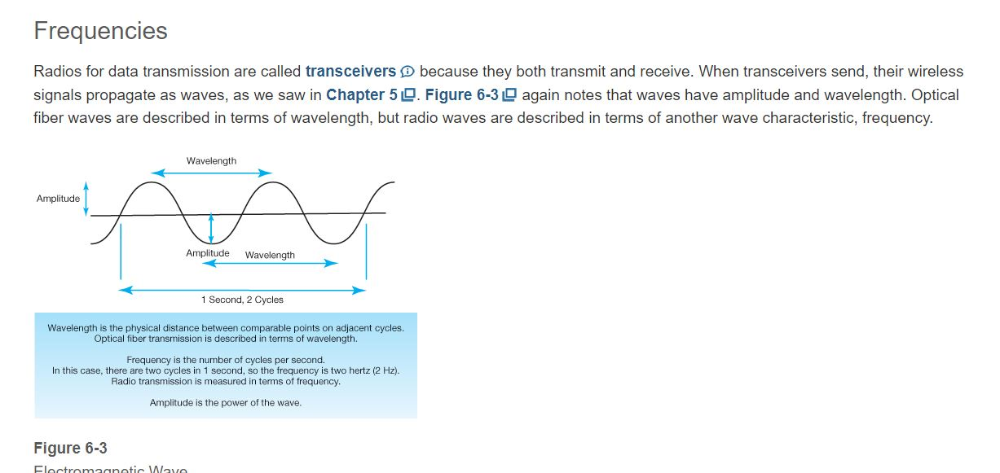

Chapter 6 Wireless LANs I

# Learning Objectives
By the end of this chapter, you should be able to:
- Explain basic Wi-Fi 802.11 terminology and the role of access points.
- Explain basic radio signal propagation concepts, including frequencies, antennas, and wireless propagation problems. These are physical layer concepts.
- Explain the frequency spectrum, service bands, channels, bandwidth, licensed versus unlicensed service bands, and the type of spread spectrum transmission used in 802.11 Wi-Fi LANs. These are also physical layer concepts.
- Describe 802.11 Wi-Fi WLAN operation with access points and a switched Ethernet distribution system to link the access points. Distinguish between BSSs, ESSs, and SSIDs. Discuss communication between access points. These are data link layer concepts.
- If you read the box, “Media Access Control (MAC),” compare CSMA/CA+ACK and RTS/CTS for media access control. These are data link layer concepts.
- Compare and contrast the 802.11n and 802.11ac transmission standards. Discuss emerging trends in 802.11 operation, including channels with much wider bandwidth, MIMO, beamforming, and multiuser MIMO. These are physical layer concepts.
- If you read the box, “802.11/Wi-Fi Notes,” Be able to know what happens when devices follow different Wi-Fi standards, explain how devices that follow new Wi-Fi standards get released in profile waves, and describe emerging 802.11 standards and what they will bring.

# Frequencies
