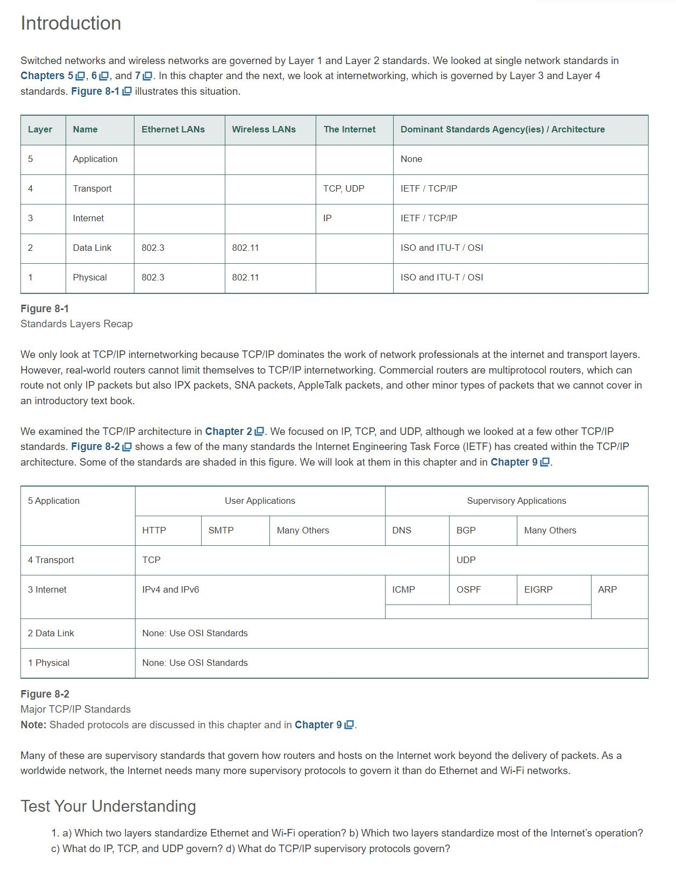

Chapter 8 TCP/IP Internetworking I

# Learning Objectives
- By the end of this chapter, you should be able to:
- Define hierarchical IPv4 addresses, networks and subnets, border and internal routers, and masks.
- Given an arriving packet’s destination IPv4 address, explain what the router will do with the packet based on its routing table.
- Explain the IPv4 packet header fields we did not see in earlier chapters.
- Explain the IPv6 packet’s main header fields and IPv6’s use of extension headers.
- Convert a 128-bit IPv6 address into canonical text notation consistent with RFC 5952.
- Explain TCP segment fields, UDP datagram fields, and TCP session closings.
- Explain why application message fragmentation is not possible with UDP.

# Introduction
