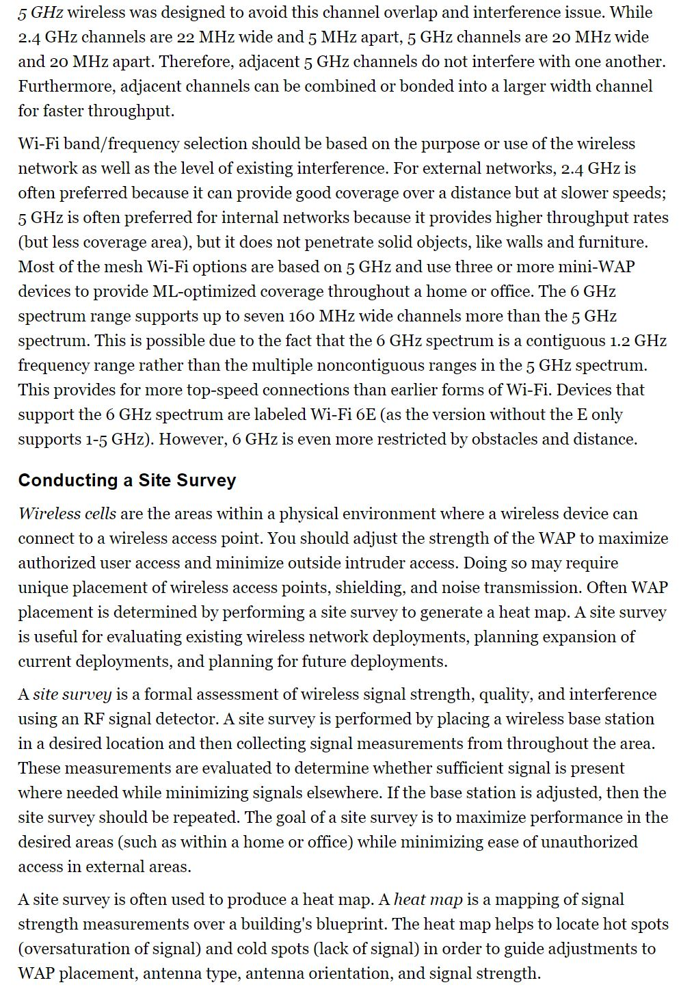
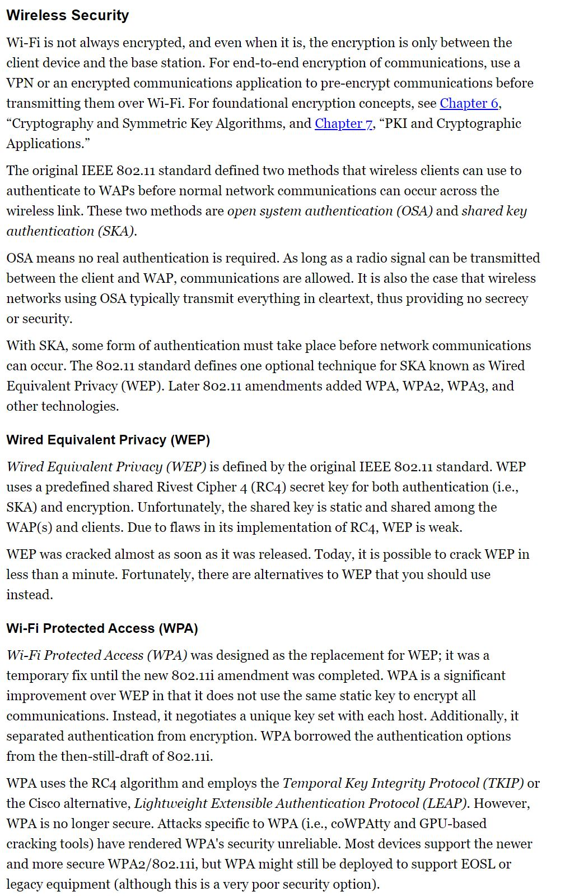

# OSI Model

## Interior Routing Protocols
1. Distance Vector routing protocols
- RIP:      Routing Information Protocol
- IGRP:     Interior Gateway Routing Protocol
- EIGRP:    Enhanced Interior Gateway Routing Protocol (Advanced)

2. Link State routing protocols
- OSPF:     Open Shortest Path First
- IS-IS:    Intermediate System to Intermediate System

## Exterior Routing Protocols
1. Path Vector routing protocols
- BGP:      Border Gateway Protocol  
Major distinction from interior is that exterior protocols make next hop decisions based on the entire remaining path (i.e., vector) to the destination. Interior protocols makes next hop decisions based solely on information related to that next immediate hop. Interior RPs are myopic, whereas exterior RPs are far-sighted.

# TCP/IP Model

# Analyzing Network Traffic

# Common Application Layer Protocols

# Transport Layer Protocols

# Domain Name System
TLD - First 7: com, org, edu, mil, gov, net. int was replaced by two-letter country codes
Total len of FQDN can't exceed 253 chars.
Any single section can't exceed 63 chars.
Though not typically shown, there is a dot to the right of the RLD, which represents the root of the entire DNS namespace.

Every registered domain name has an assigned authoritative name server.
The primary auth ns hosts the original EDITABLE zone file for the domain.
The secondary auth ns can be used to host READ-ONLY copies of the zone file.

DNS operates over TCP and UDP port 53. T53 is used for zone transfers, for special manual queries, or when a response exceeds 512 bytes. U53 is used for most typical DNS queries.

Domain Name System Security Extensions (DNSSEC)'s primary function is to provide mutual certificate auth and encrypted sessions between devices during DNS ops. DNSSEC will reduce server-focused DNS abuses but it only applies to DNS servers, not to systems performing queries against DNS servers (such as clients).

Non-DNS Servers should consider using DNS over HTTPS (DoH).
A late 2020 enhancement to DoH is Oblivious DoH (ODoH). ODoH adds a DNS proxy between the client and the DNS resolver so that the identity of the requesting client is isolated from the DNS resolver. Thus, ODoH provides anonymity and privacy to DNS queries.

## DNS Poisoning

## Rogue DNS Server

## Performing DNS Cache Poisoning

## DNS Pharming

## Altering the Hosts File

## Corrupt the IP Configuration

## DNS Query Spoofing

## Use Proxy Falsification

## Defenses to DNS Poisoning
- Limit zone transfers from internal DNS servers to external DNS servers by blocking inbound T53 requests and U53 queries.
- Require internal clients to resolve all domain names through the internal DNS. This will require that you block outbound U53 while keeping open outbound T53.
- Limit the external DNS servers from which internal DNS servers pull zone transfers.
- Properly harden all DNS, server, and client systems in your private network.
- Use DNSSEC to secure your DNS infrastructure.
- Use DoH or ODoH on all clients where supported.
- Orgs should use a split-DNS system aka split-horizon, split-view, split-brain DNS.
- A DNS sinkhole is a specific example of a false telemetry system aka sinkhole server, internet sinkhole, and blackhole DNS.

## Domain Hijacking

## Typosquatting

## Homograph Attack

## URL Hijacking

## Clickjacking

# Internet Protocol (IP) Networking

# ARP Concerns
1. ARP Cache Poisoning or ARP Spoofing

2. Gratuitous ARP or unsolicited ARP replies

3. static ARP entries

## Defense
The best defense against ARP-based attacks is port security on the switch.
- arpwatch

# Secure Communication Protocols
- IPsec.    The primary use of IPsec is for VPNs so IPsec can operate in either transport or tunnel mode.
- Kerberos. Offers a SSO solution for users and proivdes protection for logon creds.
- SSH.      Can be used to encrypt numerous plaintext utilities (such as rcp, rlogin, and rexec), serve as a protocol encrypter (such as with SFTP), and function as a transport mode VPN (i.e., host to host and link encryption only).
- Signal Protocol.  This is a cryptographic protocol that provides end-to-end encryption for voice comms, videoconferencing, and text message services.
- S-RPC.    The Secure Remote Procedure Call is an auth service for cross-network service comms and is simply a means t oprevent unauth exec of code on remote systems.
TLS.

# Implications of Multilayer Protocols

## Converged Protocols

### SAN - Storage Area Network

### FCoE - Fibre Channel over Ethernet

### MPLS - Multiprotocol Label Switching

### iSCSI - Internet Small Computer System Interface

## Voice over Internet Protocol (VoIP)

### Attacks
- Caller ID can be falsified easily. VoIP Phising or Spam over Internet Telephony (SPIT).
- Call manager systems might be vulnerable to host OS attacks and Dos.
- Mitm/on-path attacks by spoofing call managers or endpoint connection negotiations and/or responses.
- 802.1X auth falsification as well as VLAN and VoIP hopping (i.e., jumping across authenticated channels).
- Since VoIP is just network traffic, it is often possible to listen in on VoIP comms by decoding the VoIP traffic when it isn't encrypted.

### Defenses
- SRTP - Secure Real-Time Transport Protocol or Secure RTP
- RTP or SRTP takes over after Session Initiation Protocol (SIP) establishes the comm link between endpoints.

## Software-Defined Networking (SDN)

# Microsegmentation
- Boosting Performance Network
- Reducing Communication Problems
- Providing Security

# Wireless Networks

## Securing the SSID

## Wireless Channels

## Conducting a Site Survey

## Wireless Security

### WEP - Wired Equivalent Privacy

### WPA - Wi-Fi Protected Access

### WPA2 - Wi-Fi Protected Access 2

### WPA3 - Wi-Fi Protected Access 3

### 802.1X/EAP - Extensible Authentication Protocol

### LEAP - Lightweight Extensible Authentication Protocol

### PEAP - Protected Extensible Authentication Protocol

### WPS - Wi-Fi Protected Setup

### Wireless MAC Filter

### Wireless Antenna Management

## General Wi-Fi Security Procedure

## Bluetooth
- Bluesniffing - bluetooth-focused network packet capturing

- Bluesmacking - DoS attack against a BT device

- Bluejacking - Sends unsolicited msgs to BT-capable devices

- Bluesnarfing - unath access of data via a BT connection. Bluesniff the MAC, then Bluesnarf

- Bluebugging - grants an attacker remote control over the hardware and software of your devices over a BT connection. The name is derived from enabling the mic on a compromised system to use it as a remote wireless bug.

All BT devices are vulnerable to bluesniffing, bluesmacking, and bluejacking. Only a few devices have been discovered to be vulnerable to bluesnarfing or bluebugging.

## RFID

## NFC - Naer-field communication

### Attacks
- On-path attacks
- Eavesdropping
- Data manipulation
- Replay attacks

## Wireless Attacks

### Wi-Fi Scanners

### Rogue Access Points

### Evil Twin

### Disassociation

### Jamming

### Initialization Vector (IV) Abuse

### Replay

# Other Communication Protocols

## LiFi - Light Fidelity

## SATCOMM - Satellite Communications
1. Low Earth Orbit (LEO), 160-2,000 km
- Starlink

2. medium Earth orbit (MEO), 2,000-35,786 km

3. geostationary orbit (GEO), 35,786 km

## Narrow-band wireless
Widely used by SCADA systems to communicate over a distance or geographic space where cables or traditional wireless are ineffective or inappropriate. Use of narrow-band wireless should be monitored and encrypted.

# Cellular Networks

# Content Distribution Networks (CDNs)

# Secure Network Components
- Intranet
- Extranet
- Screened Subnet aka DMZ is a special-purpose extranet
- Screened host

East-West Traffic vs North-South Traffic

## Static Packet Filtering Firewalls

## Application-Level Firewalls

## Circuit-Level Firewalls

## Stateful Inspection Firewalls

## Next-Generation Firewalls or Unified Threat Management (NGFW/UTM)

## Internal Segmentation Firewall (ISFW)

## Proxy

## Content/URL Filter

## Endpoint Security

# Topology

1. Ring

2. Bus (Linear, Tree)

3. Star

4. Mesh

## Analog vs Digital

## Synchronous and Asynchronous

## Baseband vs Broadband

## CSMA

## CSMA/CD

## Token Passing

## Polling

# Summary

# Exam Essentials

# Written Lab

# Review Questions

