book_cyberRiskHandbook.md

# Chapter 3: Principles Behind Cyber Risk Management
ISO 31000:2009 COBIT5 GEIT Principles
1. Meeting Stakehold needs
2. Covering the enterprises end-to-end
3. Applying a single, intergrated framework
4. Enabling a holistic approach
5. Separating governance from management

# Chapter 9: Treating Cyber Risks Using Process Capabilities

## Undocumented processes result in tribal knowledge dependency
Processes are developed within an organization to include practices and activities to meet objectives through the creation of multiple outputs.

Undocumented cybersecurity processes create an efficiency and effectiveness issue, as:
1. it is assumed that everyone is doing the same thing each time
2. the processes cannot be universally improved upon
3. time is wasted communicating processes
4. junior team members do not have the ability to learn from more senior knowledge of "best practices"
5. the wheel is reinvented again and again

ISACA COBIT5:
1. EDM - Evaluate, direct, and monitor
2. APO - Align, plan, and organize
3. BAI - Build, acquire, and implement
4. DSS - Deliver, service, and support
5. MEA - Monitor, evaluate, and assess

# Chapter 10: Treating Cyber Risks--Using Insurance and Finance

## Planning for Cyber Risk Insurance
1. Conduct Pre-Breach Education and Planning
Proper planning decreases the frequency likelihood and positively impacts an organization's ability to respond to an incident.

2. Develop an Incident Response Plan and Crisis Management Plan
An IR plan escalating to a crisis management plan outlines responsibilities, procedures, and decision trees at a high level if an incident occurs that is then not contained within standard IT incident protocols.

3. Create A Breach Business Continuity Plan

4. Review or Implement Cyber Insurance

## The Risk Manager's Perspective on Planning for Cyber Insurance
1. Coordinate all four plan summarized above.
2. Cyber Insurance
3. Vendors and the Supply Chain
4. Insurance Gaps
5. Filing a cyber claim
6. Captive Insurer
7. Market Trends

## Cyber Insurance Market Constraints
- Regulatory Constraints

- Capacity Constraints

- Insurance Placement Constraints

# Chapter 12: Cybersecurity Incident and Crisis Management
1. Internal Incident Identification
2. External Incident Identification

## Qualifying Incidents
A structured and formal qualification process must be put in place to ensure that an identified incident will be managed with the appropriate level of attention. Several criteria need to be agreed and used to evaluate incidents. These should include:

- Sensitivity of the data or processes concerned (R&D and data dealt by VIPs)
- The functional perimet (# of users or entities impacted)
- The technical perimeter (# of workstations/servers impacted, partner's systems)
- The probable cause of the cybersecurity incident (Malevolence, human error, etc.)

Following this qualification, the incident may be managed normally with predefined processes or it may trigger escalation to the crisis management process.

## Cybersecurity Incident Must-Have Checklist
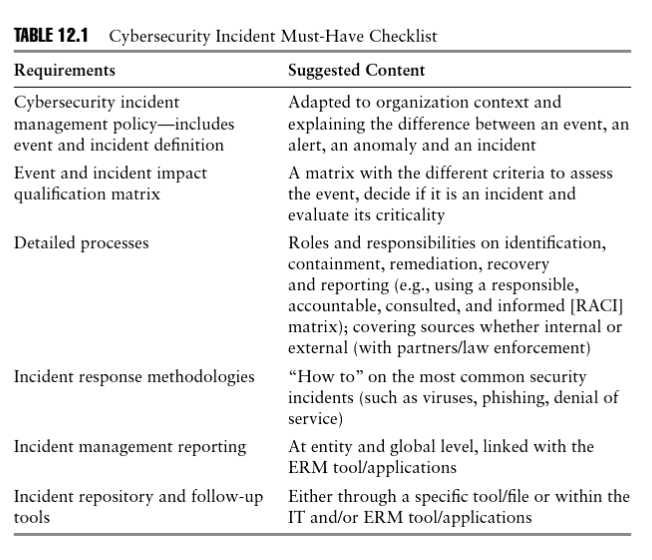

## Crisis Management Operating Principles
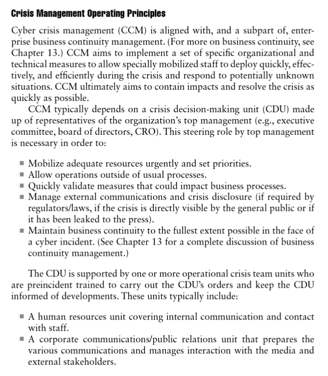
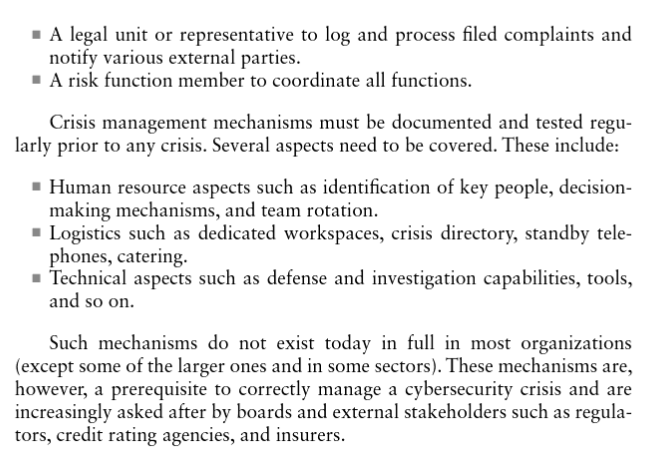

## Structuring and Mobilizing an Operation Cybersecurity Crisis Unit
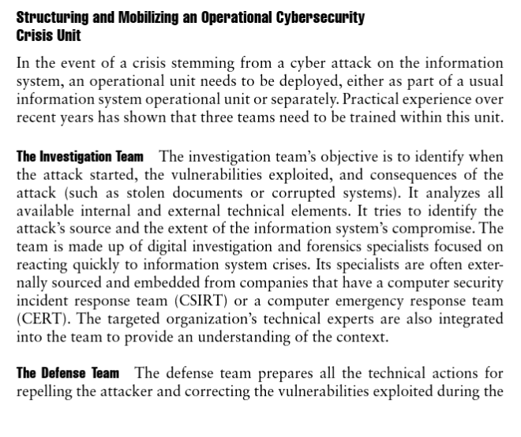
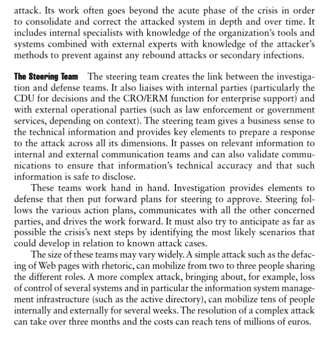

## Tools and Techniques for Managing a Cyber Crisis
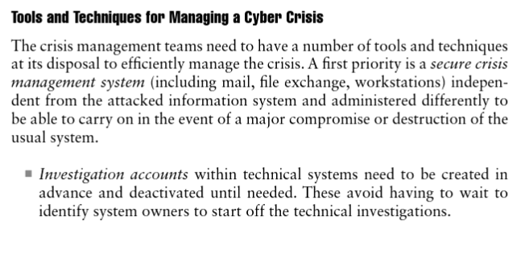
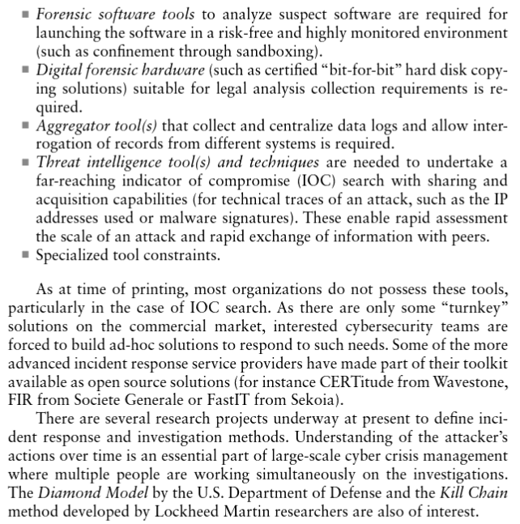

## Cyber Crisis Management Steps
Similar to general crisis management, a full-scale cyber attack management follows four steps, being:
1. Alert and qualification
2. Crisis handling (by carrying out an investigation and a defense plan)
3. Execution and surveillance
4. Crisis closure
The key difference for cyber over general crisis management lies in the cyber specificities, especially regarding how to stop the attack. This section details these specificities within the context of cyber crisis management steps and timings as visualized in the figure below:
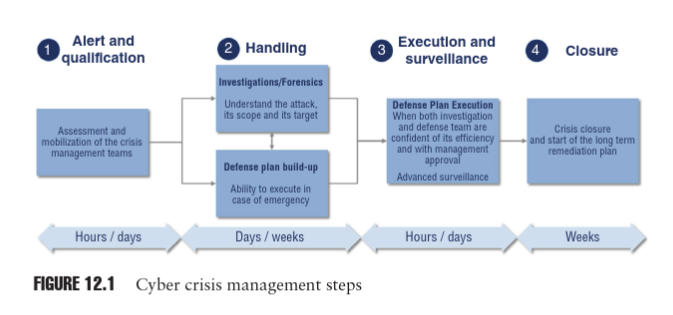
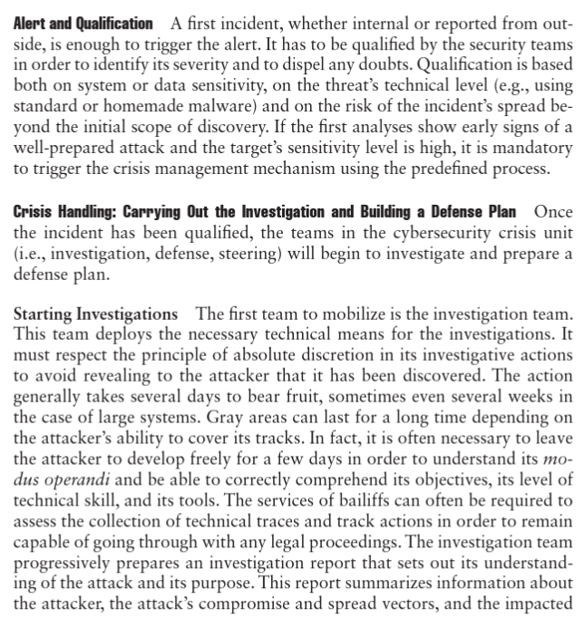
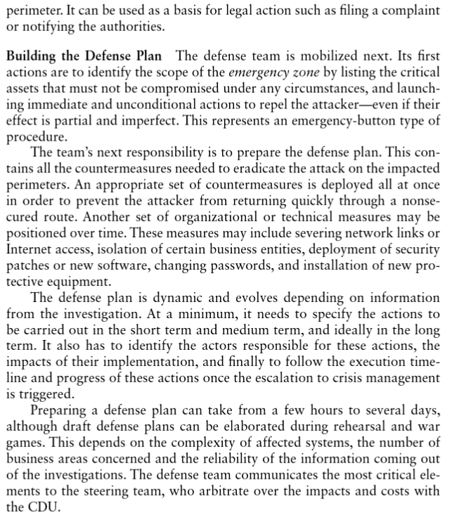
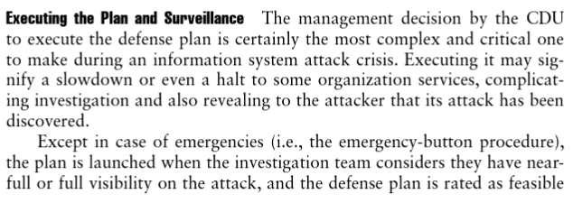
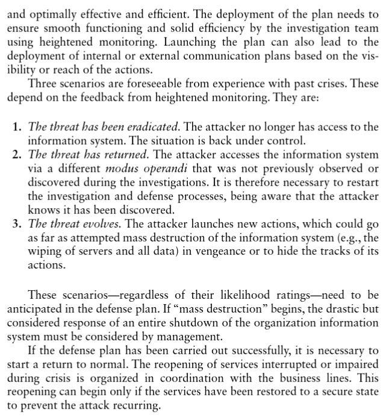
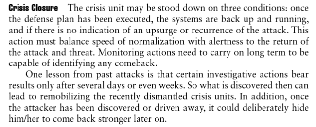
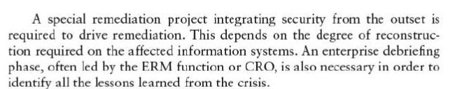

# Chapter 13: Business Continuity Management and Cybersecurity
A Business Continuity management System (BCMS) can be considered a specialized child and subset of its parent enterprise-level risk management system (ERM).

The international BCM standard called "ISO 22301: Societal security-Business continuity management systems-Requirements" provides a framework consisting of international best practices.

## Acronyms:
BCP     - Business Continuity Plan
Typically made up of the corporate wide or level BCP and the business unit BCPs. The BCPs focus on the continuity, recovery, and resumption of the critical business unit functions (that is, non-technology-based recovery). 

The corporate BCP contains the corporate level processes and procedures for business continuity, recovery, resumption, restoration, and return to normal operations. 

The business unit BCPs contain the recovery and resumption processes and procedures for the critical business functions; which were identified and prioritized during the business impact analysis.

CCP     - Crisis Communications Plan
CMP     - Crisis Management Plan
Contains the processes and procedures for the senior management team to control and ensure coordination of major crisis incidents. The CCP complements the CMP.  It contains the processes, procedures, and templates to manage internal and external communications during a crisis. Together, the CMP and CCP enable organizations to command, control and coordinate information, decisions, and communications during a crisis.

CMT     - Crisis Management Team
DRP     - Disaster Recovery Plan
Documents the processes and procedures for the recovery of IT servers, networks, applications, and databases; usually at an alternate site called the IT disaster recovery center. The IT DRP focuses on the technical recovery of IT systems and infrastructure.

ICT     - Information and Communications Technology
IMP     - Incident Management Plan

# Chapter 15: Internal Organiza

tion Context
RASCI Matrix Chart  
- Responsibility: person or role responsible for carrying out or doing the task.
- Accountable: person or reole responsible for ensuring that the whole task is completed, approved, and/or successful.
- Support: person or role providing support to the task during the implementing of the task/activity/process or service. Typically, a peer or less senior function or advisor.
- Consulted: person or role whose advice or subject matter expertise is required before and/or during the task in order to complete it.
- Informed: person or role that needs to be kept informed during and/or after the task, including who should be informed about the task or the decisions to complete the task.

# Chapter 16: Culture and Human Factors
Using Frameworks to address social engineering

## ISO 270001:2013

## BMIS Business Model for Information Security (ISACA COBIT 5)

## NIST National Institure of Standards and Technology

# Chapter 18: Assurance and Cyber Risk Management
1. Understand the organization objectives
2. Map the digital services to the organization objectives
3. Assess cyber risks--these will spotlight the critical digital services and assets
4. Treat cyber risks
5. Monitor the risks and effectiveness of implemented cyber risk treatments, including controls
6. Report by management to CEO and board on the effectiveness of the treatments and cyber breach incidents
7. Obtain independent assurance and independent reporting to the board

# Chapter 21: Cybersecurity for Operations and Communications
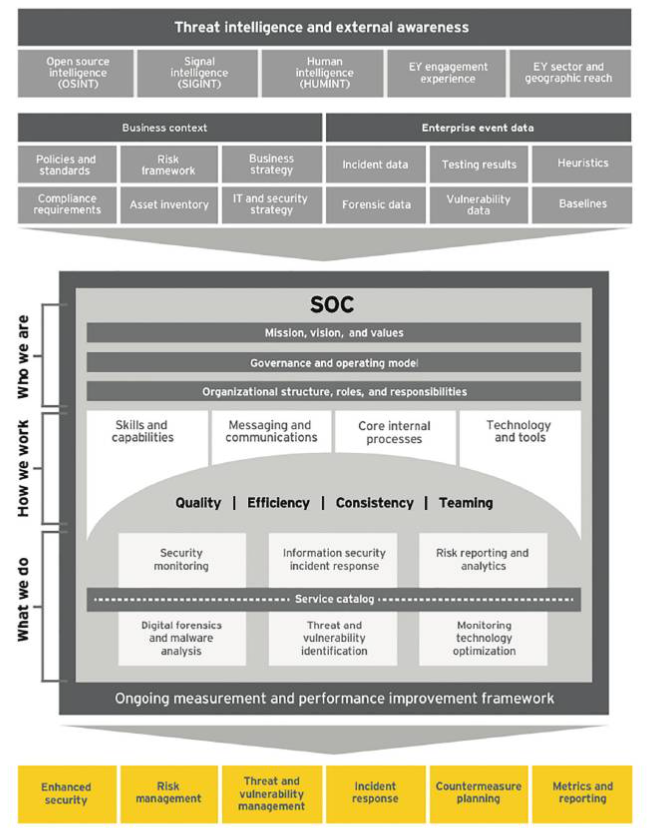

# Chapter 23: Cybersecurity Systems: Acquisition, Development, and Maintenance
Organizations can build their information systems in many ways, suchs as the traditional dev process, purchase of readily available software, or use cloud/software as a service (SaaS) applications.
- Commercial off-the-shelf (COTS) applications. Applications dev by vendors and installed on the org's info sys. These apps are usually purchased outright by orgs with usage based on licensing agreements.
- Cloud/SaaS apps. Apps dev by service providers or vendors and installed on the provider or vendor info sys. Orgs typically have an on-demand or pay-per-usage metrics.
- In-house dev apps. Apps dev, installed, and maintained by the org using internal teams and/or contractors.

#

#