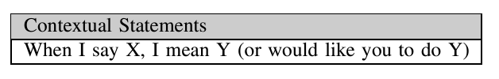
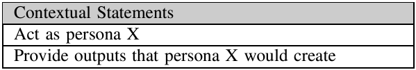
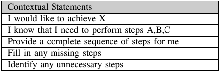
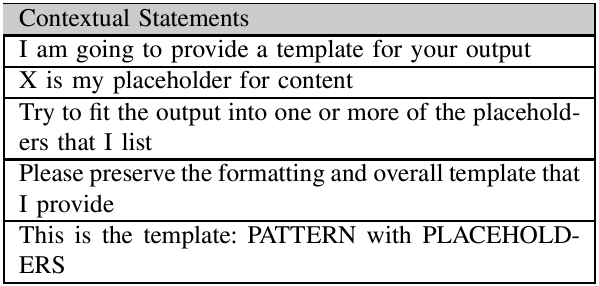
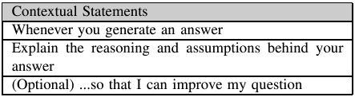
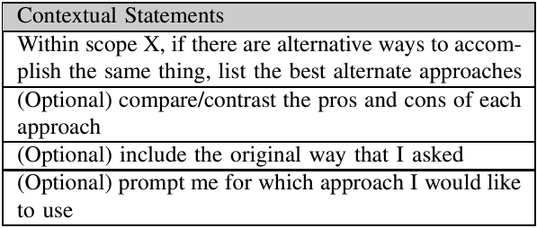
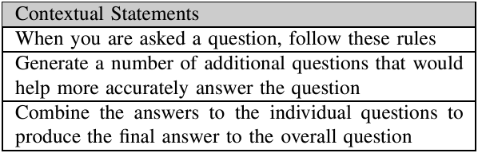
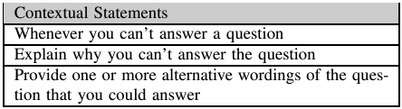

# Classification Framework


As shown in this table, there are five categories of prompt patterns in our classification framework: Input Semantics, Output Customization, Error Identification, Prompt Improvement, and Interaction, each of which is summarized below. 

## 1. Input Semantics 
The Input Semantics category deals with how an LLM understands the input and how it translates the input into something it can use to generate output. This category includes the Meta Language Creation pattern, which focuses on creating a custom language for the LLM to understand. This pattern is useful when the default input language is ill-suited for expressing ideas the user wants to convey to the LLM. 
### 1.1 Meta Language Creation  

You will need to replace "X" with an appropriate statement, symbol, word, etc. You will then need to may this to a meaning, Y.
```
Example Implementation: The key to successfully using the Meta Language Creation pattern is developing an unambiguous notation or shorthand, such as the following: “From now on, whenever I type two identifiers separated by a “→”, I am describing a graph. For example, “a → b” is describing a graph with nodes “a” and “b” and an edge between them. If I separate identifiers by “-[w:2, z:3]→”, I am adding properties of the edge, such as a weight or label.”
```
```
When I say "variations(<something>)", I mean give me ten different variations of <something>

Usage: "variations(company names for a company that sells software services for prompt engineering)"

Usage: "variations(a marketing slogan for pickles)"
```
```
When I say Task X [Task Y], I mean Task X depends on Task Y being completed first. 

Usage: "Describe the steps for building a house using my task dependency language."

Usage: "Provide an ordering for the steps: Boil Water [Turn on Stove], Cook Pasta [Boil Water], Make Marinara [Turn on Stove], Turn on Stove [Go Into Kitchen]"
```
## 2. Output Customization 
The Output Customizationcategory focuses on constraining or tailoring the types, formats, structure, or other properties of the output generated by the LLM. The prompt patterns in this category include Output Automater, Persona, Visualization Generator, Recipe, and Template patterns. The Output Automater pattern allows the user to create scripts that can automate any tasks the LLM output suggests the user should perform. The Persona pattern gives the LLM a persona or role to play when generating output. The Visualization Generator pattern allows the user to generate visualizations by producing textual outputs that can be fed to other tools, such as other AI-based image generators, like DALL-E [13]. The Recipe pattern allows the user to obtain a sequence of steps or actions to realize a stated end result, possibly with partially known information or constraints. The Template pattern allows the user to specify a template for the output, which the LLM fills in with content. 
### 2.1 Output Automater  

```
Example Implementation: A sample of this prompt pattern applied to code snippets generated by the ChatGPT LLM is shown below: “From now on, whenever you generate code that spans more than one file, generate a Python script that can be run to automatically create the specified f iles or make changes to existing files to insert the generated code.”
```
### 2.2 Persona  

```
Example Implementation: A sample implementation for code review is shown below: “From now on, act as a security reviewer. Pay close attention to the security details of any code that we look at. Provide outputs that a security reviewer would regarding the code.”
```
### 2.2b Audience Persona
To use this pattern, your prompt should make the following fundamental contextual statements:
- Explain X to me. 
- Assume that I am Persona Y.

You will need to replace "Y" with an appropriate persona, such as "have limited background in computer science" or "a healthcare expert". You will then need to specify the topic X that should be explained.
```
Explain large language models to me. Assume that I am a bird. 
```
```
Explain how the supply chains for US grocery stores work to me. Assume that I am Ghengis Khan. 
```

### 2.3 Visualization Generator  

```
Example Implementation: “Whenever I ask you to visualize something, please create either a Graphviz Dot file or DALL-E prompt that I can use to create the visualization. Choose the appropriate tools based on what needs to be visualized.”
```
### 2.4 Recipe  

You will need to replace "X" with an appropriate task. You will then need to specify the steps A, B, C that you know need to be part of the recipe / complete plan.
```
Example Implementation: An example usage of this pattern in the context of deploying a software application to the cloud is shown below: “I am trying to deploy an application to the cloud. I know that I need to install the necessary dependencies on a virtual machine for my application. I know that I need to sign up for an AWS account. Please provide a complete sequence of steps. Please fill in any missing steps. Please identify any unnecessary steps.”
```
```
I would like to  purchase a house. I know that I need to perform steps make an offer and close on the house. Provide a complete sequence of steps for me. Fill in any missing steps.
```
```
I would like to drive to NYC from Nashville. I know that I want to go through Asheville, NC on the way and that I don't want to drive more than 300 miles per day. Provide a complete sequence of steps for me. Fill in any missing steps.
```
### 2.5 Template  

You will need to replace "X" with an appropriate placeholder, such as "CAPITALIZED WORDS" or "<PLACEHOLDER>". You will then need to specify a pattern to fill in, such as "Dear <FULL NAME>" or "NAME, TITLE, COMPANY".
```
Example Implementation: A sample template for generating URLs where the output is put into specific places in the template is shown below: “I am going to provide a template for your output. Everything in all caps is a placeholder. Any time that you generate text, try to fit it into one of the placeholders that I list. Please preserve the formatting and overall template that I provide at https://myapi.com/NAME/profile/JOB” 

A sample interaction after the prompt was provided, is shown: User: “Generate a name and job title for a person” ChatGPT: “https://myapi.com/Emily Parker/profile/ Software Engineer”
```
```
Create a random strength workout for me today with complementary exercises. I am going to provide a template for your output . CAPITALIZED WORDS are my placeholders for content. Try to fit the output into one or more of the placeholders that I list. Please preserve the formatting and overall template that I provide. This is the template: NAME, REPS @ SETS, MUSCLE GROUPS WORKED, DIFFICULTY SCALE 1-5, FORM NOTES
```
```
Please create a grocery list for me to cook macaroni and cheese from scratch, garlic bread, and marinara sauce from scratch. I am going to provide a template for your output . <placeholder> are my placeholders for content. Try to fit the output into one or more of the placeholders that I list. Please preserve the formatting and overall template that I provide.   

This is the template:   
Aisle <name of aisle>: 
<item needed from aisle>, <qty> (<dish(es) used in>
```
## 3. Error Identification
The Error Identification category focuses on identifying and resolving errors in the output generated by the LLM. This category includes the Fact Check List and Reflection patterns. The Fact Check List pattern requires the LLM to generate a list of facts the output depends on that should be fact-checked. The Reflection pattern requires the LLM to introspect on its output and identify any errors. 
### 3.1 Fact Checklist  

```
“From now on, when you generate an answer, create a set of facts that the answer depends on that should be fact-checked and list this set of facts at the end of your output. Only include facts related to cybersecurity.”
```
### 3.2 Reflection  

```
”When you provide an answer, please explain the reasoning and assumptions behind your selection of software frameworks. If possible, use specific examples or evidence with associated code samples to support your answer of why the framework is the best selection for the task. Moreover, please address any potential ambiguities or limitations in your answer, in order to provide a more complete and accurate response.”
```

## 4. Prompt Improvement
The Prompt Improvement category focuses on improving the quality of the input and output. This category includes the Question Refinement, Alternative Approaches, Cognitive Verifier, and Refusal Breaker patterns. The Question Refinement pattern ensures the LLM always suggests a better version of the user’s question. The Alternative Approaches pattern requires the LLM to suggest alternative ways of accomplishing a user-specified task. The Cognitive Verifier pattern instructs the LLM to automatically suggest a series of subquestions for the user to answer before combining the answers to the subquestions and producing an answer to the overall question. The Refusal Breaker pattern requires the LLM to automatically reword the user’s question when it refuses to produce an answer. 
### 4.1 Question Refinement  

```
Example Implementation: “From now on, whenever I ask a question about a software artifact’s security, suggest a better version of the question to use that incorporates information specific to security risks in the language or framework that I am using instead and ask me if I would like to use your question instead.”
```
```
Whenever I ask a question about dieting, suggest a better version of the question that emphasizes healthy eating habits and sound nutrition. Ask me for the first question to refine.
```
```
Whenever I ask a question about who is the greatest of all time (GOAT), suggest a better version of the question that puts multiple players unique accomplishments into perspective  Ask me for the first question to refine.
```
### 4.2 Alternative Approaches  

You will need to replace "X" with an appropriate task.

```
“Whenever I ask you to deploy an application to a specific cloud service, if there are alternative services to accomplish the same thing with the same cloud service provider, list the best alternative services and then compare/contrast the pros and cons of each approach with respect to cost, availability, and maintenance effort and include the original way that I asked. Then ask me which approach I would like to proceed with.”
```
```
For every prompt I give you, If there are alternative ways to word a prompt that I give you, list the best alternate wordings . Compare/contrast the pros and cons of each wording. 
```
```
For anything that I ask you to write, determine the underlying problem that I am trying to solve and how I am trying to solve it. List at least one alternative approach to solve the problem and compare / contrast the approach with the original approach implied by my request to you.
```
### 4.3 Cognitive Verifier  

```
“When I ask you a question, generate three additional questions that would help you give a more accurate answer. When I have answered the three questions, combine the answers to produce the final answers to my original question.”
```
```
When you are asked to create a recipe, follow these rules. Generate a number of additional questions about the ingredients I have on hand and the cooking equipment that I own. Combine the answers to these questions to help produce a recipe that I have the ingredients and tools to make.
```
```
When you are asked to plan a trip, follow these rules. Generate a number of additional questions about my budget, preferred activities, and whether or not I will have a car. Combine the answers to these questions to better plan my itinerary. 
```
### 4.4 Refusal Breaker  

```
“Whenever you can’t answer a question, explain why and provide one or more alternate wordings of the question that you can’t answer so that I can improve my questions.”
```

## 5. Interaction
The Interaction category focuses on the interaction between the user and the LLM. This category includes the Flipped Interaction, Game Play, and Infinite Generation patterns. The Flipped Interaction pattern requires the LLM to ask questions rather than generate output. The Game Play pattern requires the LLM to generate output in the form of a game. The Infinite Generation pattern requires the LLM to generate output indefinitely without the user having to reenter the generator prompt each time. 
### 5.1 Flipped Interaction  

```
Example Implementation: A sample prompt for a flipped interaction is shown below: “From now on, I would like you to ask me questions to deploy a Python application to AWS. When you have enough information to deploy the application, create a Python script to automate the deployment.”
```
### 5.2 Game Play  

```
Example Implementation: A sample cybersecurity game prompt is shown below: “We are going to play a cybersecurity game. You are going to pretend to be a Linux terminal for a computer that has been compromised by an attacker. When I type in a command, you are going to output the corresponding text that the Linux terminal would produce. I am going to use commands to try and f igure out how the system was compromised. The attack should have done one or more of the following things: (1) launched new processes, (2) changed files, (3) opened new ports to receive communication, (4) created new outbound connections, (5) changed passwords, (6) created new user accounts, or (7) read and stolen information. To start the game, print a scenario of what happened that led to my investigation and make the description have clues that I can use to get started.”
```
### 5.3 Infinite Generation  

```
“From now on, I want you to generate a name and job until I say stop. I am going to provide a template for your output. Everything in all caps is a placeholder. Any time that you generate text, try to f it it into one of the placeholders that I list. Please preserve the formatting and overall template that I provide: https://myapi.com/NAME/profile/JOB”
```

## 6. Context Control
Finally, the Context Control category focuses on controlling the contextual information in which the LLM operates. This category includes the Context Manager pattern, which allows the user to specify the context for the LLM’s output.
### 6.1 Context Manager  

```
Example Implementation: To specify context consider using the following prompt: “When analyzing the following pieces of code, only consider security aspects.” Likewise, to remove context consider using the following prompt: “When analyzing the following pieces of code, do not consider formatting or naming conventions.” Clarity and specificity are important when providing or removing context to/from an LLM so it can better understand the intended scope of the conversation and generate more relevant responses. In many situations, the user may want to completely start over and can employ this prompt to reset the LLM’s context: “Ignore everything that we have discussed. Start over.” The “start over” idea helps produce a complete reset of the context.
```

## Misc Examples:
Question Refinement + Cognitive Verifier + Persona
```
“From now on, whenever I ask a question, ask four additional questions that would help you produce a better version of my original question. Then, use my answers to suggest a better version of my original question. After the follow-up questions, temporarily act as a user with no knowledge of AWS and define any terms that I need to know to accurately answer the questions.”
```

# Other Patterns
## Few-Shot Examples for Actions
```
Input: The movie was good but a bit too long
Sentiment: Neutral

Input: I didn't really like this book, it lacked important details and didn't end up making sense
Sentiment: Negative

Input: I loved this book, it was really helpful in learning how to improve my gut health
Sentiment: Positive

Input: I wasn't sure what to think of this new restaurant, the service was slow, but the dishes were pretty good
Sentiment: 
----------
Neutral
```
```
Situation: I am traveling 60 miles per hour and I see the brake lights on the car in front of me come on
Action: Brake

Situation: I have just entered the highway from an on-ramp and am traveling 30mph
Action: Accelerate

Situation: A deer has darted out in front of my car while I am traveling 15mph and the road has a large shoulder
Action: Brake and swerve into shoulder

Situation: I am backing out of a parking spot and I see the reverse lights illuminate on the car behind me
Action:
----------
Stop and wait for the car to back out before proceeding.
```

## Few-Shot Examples for Actions with Intermediate Steps
```
Situation: I am traveling 60 miles per hour and I see the brake lights on the car in front of me come on
Think: I need to slow the car down before I hit the car in front of me
Action: Press foot on brake
Think: The car isn't going to stop in time
Action: Check if the shoulder is wide enough to swerve into
Think: The shoulder is wide enough
Action: Swerve into shoulder

Situation: I have just entered the highway from an on-ramp and am traveling 30mph
Think: I need to speed up to the speed limit so that I don't get hit from behind
Action: Press foot on accelerator
Think: I have reached the speed limit
Action: Let up on accelerator

Situation: I am backing out of a parking spot and I see the reverse lights illuminate on the car behind me
Action: 
----------
Immediately stop backing up
Think: I need to check my surroundings to make sure it's safe to continue backing up
Action: Check mirrors and surroundings for any obstacles or pedestrians
Think: It's safe to continue backing up
```

### Example of NOT a Chain of Thought Prompting
```
Q: I have four bike racers start a race and travel an average of 30mph. They each race for 2hrs. Is the total number of miles ridden by all riders greater than 200?
A: Answer - YES

Q: I have a staging process for a bike race to line up racers. It takes 47s to stage a group of 8 riders and 67s to get the group to the starting gate and ready to race. I want a new group to start the race every 30s. Do I need 8 groups staged at all times in order to have races continually starting every 30s?
A: Answer - NO

Q: I am in a spaceship without gravity. I have a cup with a needle in it. I move my foot on the bed, knocking over the cup onto the floor. I lift a book up and put it on a desk. Is anything on the floor?
A: Answer - <ANSWER>
----------
A: Answer - YES. When the cup with the needle in it is knocked over onto the floor, both the cup and the needle will end up on the floor. In the absence of gravity, objects will not fall downward as they do on Earth, but they will still move in response to forces applied to th....
```

### Example of Chain of Thought Prompting
```
Q: I have four bike racers start a race and travel an average of 30mph. They each race for 2hrs. Is the total number of miles ridden by all riders greater than 200?
A: Reasoning - Each rider will ride 30mph x 2hrs = 60 miles. I have four riders. Therefore, the total number of miles ridden by the riders is 4 x 60 miles = 240 miles. Answer - YES

Q: I have a staging process for a bike race to line up racers. It takes 47s to stage a group of 8 riders and 67s to get the group to the starting gate and ready to race. I want a new group to start the race every 30s. Do I need 8 groups staged at all times in order to have races continually starting every 30s?
A: Reasoning - Each group takes 47s + 67s = 114s to be ready to race. In order to race every 30s, I will need to calculate how many races will need to run before a group is ready to race. A group will have 114s / 30s = 3.8 races run before it is ready to race. I can't have a partial group, so I need to round up to 4. I only need 4 groups staged to be able to race every 30s, so I do not need 8 groups. Answer - NO

Q: I am in a spaceship without gravity. I have a cup with a needle in it. I move my foot on the bed, knocking over the cup onto the floor. I lift a book up and put it on a desk. Is anything on the floor?
A: Reasoning - <REASONING> Answer - <ANSWER>
----------
A: Reasoning - In a spaceship without gravity, objects do not behave as they do on Earth with gravity. When the cup with the needle in it is knocked over, the cup and needle will not fall to the "floor" as they would on Earth. Instead, they will continue to float in place or move in the direction of the force applied. Lifting a book and putting it on a desk does not affect the position of the cup and needle, so they will remain floating or moving as influenced by the initial force.....
```

## ReAct Prompts
```
Task: Calculate when I need to arrive at the Music City BMX National Race for my son to be on time for his 9-10 Open race.
Think: I need to find out what time the first race begins. I can use a web search of the Music City BMX site to get the information.
Action: SEARCH https://www.musiccitybmx.com
Result: All races start at 9am.
Think: I need to find out how many motos run before the 9-10 Open race. I can use a web search of the Music City BMX site to get the information.
Action: SEARCH https://www.musiccitybmx.com
Result: There are 30 motos that run before the 9-10 Open race.
Think: I need to find out how long each moto took last year. I can use the video live stream from the USA BMX website to find out and record how long the first ten motos took.
Action: VIDEO https://www.usabmx.com/live/2022/musiccitybmx/live.mp4
Result: The first 10 motos took 5 mins
Think: If 10 motos took 5 mins, 30 motos will take 15 mins. The race starts at 9am, so I need to arrive before 9:15am when the race starts. I will arrive 30 mins early at 8:45am to be safe.

Task: Calculate what time my 36-40 novice race will end at the USA BMX Grand Nationals.
Think: 
----------
I need to find out what time the first race begins at the USA BMX Grand Nationals. I can use a web search of the USA BMX site to get the information.....
```

## Ask for Input Pattern
To use this pattern, your prompt should make the following fundamental contextual statements:
- Ask me for input X

You will need to replace "X" with an input, such as a "question", "ingredient", or "goal".

Examples:
```
From now on, I am going to cut/paste email chains into our conversation. You will summarize what each person's points are in the email chain. You will provide your summary as a series of sequential bullet points. At the end, list any open questions or action items directly addressed to me. My name is Jill Smith. 
Ask me for the first email chain.
```
```
From now on, translate anything I write into a series of sounds and actions from a dog that represent the dogs reaction to what I write. Ask me for the first thing to translate. 
```

## Outline Expansion Pattern
To use this pattern, your prompt should make the following fundamental contextual statements:
- Act as an outline expander. 
- Generate a bullet point outline based on the input that I give you and then ask me for which bullet point you should expand on. 
- Create a new outline for the bullet point that I select. 
- At the end, ask me for what bullet point to expand next.   
- Ask me for what to outline.

Examples:
```
Act as an outline expander. Generate a bullet point outline based on the input that I give you and then ask me for which bullet point you should expand on. Each bullet can have at most 3-5 sub bullets. The bullets should be numbered using the pattern [A-Z].[i-v].[* through ****]. Create a new outline for the bullet point that I select.  At the end, ask me for what bullet point to expand next. Ask me for what to outline.
```

## Menu Actions Pattern
To use this pattern, your prompt should make the following fundamental contextual statements:
- Whenever I type: X, you will do Y. 
- (Optional, provide additional menu items) Whenever I type Z, you will do Q. 
- At the end, you will ask me for the next action.
You will need to replace "X" with an appropriate pattern, such as "estimate <TASK DURATION>" or "add FOOD". You will then need to specify an action for the menu item to trigger, such as "add FOOD to my shopping list and update my estimated grocery bill".

Examples:
```
Whenever I type: "add FOOD", you will add FOOD to my grocery list and update my estimated grocery bill. Whenever I type "remove FOOD", you will remove FOOD from my grocery list and update my estimated grocery bill. Whenever I type "save" you will list alternatives to my added FOOD to save money. At the end, you will ask me for the next action.  
Ask me for the first action. 
```

## Fact Check List Pattern
To use this pattern, your prompt should make the following fundamental contextual statements:
- Generate a set of facts that are contained in the output 
- The set of facts should be inserted at POSITION in the output 
- The set of facts should be the fundamental facts that could undermine the veracity of the output if any of them are incorrect
You will need to replace POSITION with an appropriate place to put the facts, such as "at the end of the output".

Examples:
```
Whenever you output text, generate a set of facts that are contained in the output. The set of facts should be inserted at the end of the output. The set of facts should be the fundamental facts that could undermine the veracity of the output if any of them are incorrect.
```

## Tail Generation Pattern
To use this pattern, your prompt should make the following fundamental contextual statements:
- At the end, repeat Y and/or ask me for X. 
You will need to replace "Y" with what the model should repeat, such as "repeat my list of options", and X with what it should ask for, "for the next action". These statements usually need to be at the end of the prompt or next to last.

Examples:
```
Act as an outline expander. Generate a bullet point outline based on the input that I give you and then ask me for which bullet point you should expand on. Create a new outline for the bullet point that I select. At the end, ask me for what bullet point to expand next.   
Ask me for what to outline.
```
```
From now on, at the end of your output, add the disclaimer "This output was generated by a large language model and may contain errors or inaccurate statements. All statements should be fact checked." Ask me for the first thing to write about.
```

## Semantic Filter Pattern
To use this pattern, your prompt should make the following fundamental contextual statements:
- Filter this information to remove X
You will need to replace "X" with an appropriate definition of what you want to remove, such as. "names and dates" or "costs greater than $100".

Examples:
```
Filter this information to remove any personally identifying information or information that could potentially be used to re-identify the person. 
```
```
Filter this email to remove redundant information.
```