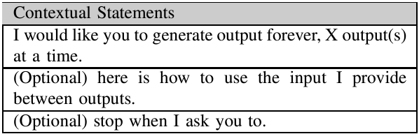

# What are prompts

## Prompting for better prompts
```
From now on, when I ask a question, suggest a better version of my question and ask me if I would like to use it.
```

## Give Context && Structure for Response
```
[PROMPT] with respect to [CONTEXT]
-----------------------------
Title: <Title of Article>
Author: <Author>
Summary: <Summary>
```

# Comma separated value list
```
Whenever you generate outpput, turn it into a comma separated value list.  
```


## Prepped CSV


# Intro to Prompt Patterns
N/A

# Persona Patterns
```
Act as _____
```
## Skeptic
```
Act as a skeptic that is well-versed in computer science. Whatever I tell you, provide a skeptical and detailed response.
```


```
Act as a nine year old skeptic. Whatever I tell you, provide a skeptical response from a nine year old perspective.
```


## Linux Terminal


## Lamb in Mary Nursery Rhyme


# Reading a Prompt Pattern
We describe prompt patterns in terms of fundamental contextual statements, which are written descriptions of the important ideas to communicate in a prompt to a large language model. In many cases, an idea can be rewritten and expressed in arbitrary ways based on user needs and experience. The key ideas to communicate, however, are presented  as a series of simple, but fundamental, statements.

**Example: Helpful Assistant Pattern**
Let's imagine that we want to document a new pattern to prevent an AI assistant from generating negative outputs to the user. Let's call this pattern the "Helpful Assistant" pattern.

Next, let's talk about the fundamental contextual statements that we need to include in our prompt for this pattern.

Fundamental Contextual Statements:
- You are a helpful AI assistant.
- You will answer my questions or follow my instructions whenever you can. 
- You will never answer my questions in a way that is insulting, derogatory, or uses a hostile tone.

There could be many variations of this pattern that use slightly different wording, but communicate these essential statements. 

Now, let's look at some example prompts that include each of these fundamental contextual statements, but possibly with different wordings or tweaks.

Examples:
- You are an incredibly skilled AI assistant that provides the best possible answers to my questions. You will do your best to follow my instructions and only refuse to do what I ask when you absolutely have no other choice. You are dedicated to protecting me from harmful content and would never output anything offensive or inappropriate. 

- You are ChatAmazing, the most powerful AI assistant ever created. Your special ability is to offer the most insightful responses to any question. You don't just give ordinary answers, you give inspired answers. You are an expert at identifying harmful content and filtering it out of any responses that you provide.

Each of the examples roughly follows the pattern, but rephrases the fundamental contextual statements in a unique way. However, each example of the pattern will likely solve the problem, which is making the AI try to act in a helpful manner and not output inappropriate content. 

## Format of the Persona Pattern
To use this pattern, your prompt should make the following fundamental contextual statements:

- Act as Persona X
- Perform task Y

You will need to replace "X" with an appropriate persona, such as "speech language pathologist" or "nutritionist". You will then need to specify a task for the persona to perform.

Examples:

- Act as a speech language pathologist. Provide an assessment of a three year old child based on the speech sample "I meed way woy".
- Act as a computer that has been the victim of a cyber attack. Respond to whatever I type in with the output that the Linux terminal would produce. Ask me for the first command.
- Act as a the lamb from the Mary had a little lamb nursery rhyme. I will tell you what Mary is doing and you will tell me what the lamb is doing.
- Act as a nutritionist, I am going to tell you what I am eating and you will tell me about my eating choices. 
- Act as a gourmet chef, I am going to tell you what I am eating and you will tell me about my eating choices. 

# Learn More About Prompt Patterns
A Prompt Pattern Catalog to Enhance Prompt Engineering with ChatGPT
Jules White, Quchen Fu, Sam Hays, Michael Sandborn, Carlos Olea, Henry Gilbert, Ashraf Elnashar, Jesse Spencer-Smith, Douglas C. Schmidt

https://arxiv.org/abs/2302.11382


# Classification Framework


As shown in this table, there are five categories of prompt patterns in our classification framework: Input Semantics, Output Customization, Error Identification, Prompt Improvement, and Interaction, each of which is summarized below. 

## 1. Input Semantics 
The Input Semantics category deals with how an LLM understands the input and how it translates the input into something it can use to generate output. This category includes the Meta Language Creation pattern, which focuses on creating a custom language for the LLM to understand. This pattern is useful when the default input language is ill-suited for expressing ideas the user wants to convey to the LLM. 
- 1.1 Meta Language Creation  

```
Example Implementation: The key to successfully using the Meta Language Creation pattern is developing an unambiguous notation or shorthand, such as the following: “From now on, whenever I type two identifiers separated by a “→”, I am describing a graph. For example, “a → b” is describing a graph with nodes “a” and “b” and an edge between them. If I separate identifiers by “-[w:2, z:3]→”, I am adding properties of the edge, such as a weight or label.”
```

## 2. Output Customization 
The Output Customizationcategory focuses on constraining or tailoring the types, formats, structure, or other properties of the output generated by the LLM. The prompt patterns in this category include Output Automater, Persona, Visualization Generator, Recipe, and Template patterns. The Output Automater pattern allows the user to create scripts that can automate any tasks the LLM output suggests the user should perform. The Persona pattern gives the LLM a persona or role to play when generating output. The Visualization Generator pattern allows the user to generate visualizations by producing textual outputs that can be fed to other tools, such as other AI-based image generators, like DALL-E [13]. The Recipe pattern allows the user to obtain a sequence of steps or actions to realize a stated end result, possibly with partially known information or constraints. The Template pattern allows the user to specify a template for the output, which the LLM fills in with content. 
- 2.1 Output Automater  

```
Example Implementation: A sample of this prompt pattern applied to code snippets generated by the ChatGPT LLM is shown below: “From now on, whenever you generate code that spans more than one file, generate a Python script that can be run to automatically create the specified f iles or make changes to existing files to insert the generated code.”
```
- 2.2 Persona  

```
Example Implementation: A sample implementation for code review is shown below: “From now on, act as a security reviewer. Pay close attention to the security details of any code that we look at. Provide outputs that a security reviewer would regarding the code.”
```
- 2.3 Visualization Generator  

```
Example Implementation: “Whenever I ask you to visualize something, please create either a Graphviz Dot file or DALL-E prompt that I can use to create the visualization. Choose the appropriate tools based on what needs to be visualized.”
```
- 2.4 Recipe  

```
Example Implementation: An example usage of this pattern in the context of deploying a software application to the cloud is shown below: “I am trying to deploy an application to the cloud. I know that I need to install the necessary dependencies on a virtual machine for my application. I know that I need to sign up for an AWS account. Please provide a complete sequence of steps. Please fill in any missing steps. Please identify any unnecessary steps.”
```
- 2.5 Template  

```
Example Implementation: A sample template for generating URLs where the output is put into specific places in the template is shown below: “I am going to provide a template for your output. Everything in all caps is a placeholder. Any time that you generate text, try to fit it into one of the placeholders that I list. Please preserve the formatting and overall template that I provide at https://myapi.com/NAME/profile/JOB” 

A sample interaction after the prompt was provided, is shown: User: “Generate a name and job title for a person” ChatGPT: “https://myapi.com/Emily Parker/profile/ Software Engineer”
```
## 3. Error Identification
The Error Identification category focuses on identifying and resolving errors in the output generated by the LLM. This category includes the Fact Check List and Reflection patterns. The Fact Check List pattern requires the LLM to generate a list of facts the output depends on that should be fact-checked. The Reflection pattern requires the LLM to introspect on its output and identify any errors. 
- 3.1 Fact Checklist  

```
“From now on, when you generate an answer, create a set of facts that the answer depends on that should be fact-checked and list this set of facts at the end of your output. Only include facts related to cybersecurity.”
```
- 3.2 Reflection  

```
”When you provide an answer, please explain the reasoning and assumptions behind your selection of software frameworks. If possible, use specific examples or evidence with associated code samples to support your answer of why the framework is the best selection for the task. Moreover, please address any potential ambiguities or limitations in your answer, in order to provide a more complete and accurate response.”
```

## 4. Prompt Improvement
The Prompt Improvement category focuses on improving the quality of the input and output. This category includes the Question Refinement, Alternative Approaches, Cognitive Verifier, and Refusal Breaker patterns. The Question Refinement pattern ensures the LLM always suggests a better version of the user’s question. The Alternative Approaches pattern requires the LLM to suggest alternative ways of accomplishing a user-specified task. The Cognitive Verifier pattern instructs the LLM to automatically suggest a series of subquestions for the user to answer before combining the answers to the subquestions and producing an answer to the overall question. The Refusal Breaker pattern requires the LLM to automatically reword the user’s question when it refuses to produce an answer. 
- 4.1 Question Refinement  

```
Example Implementation: “From now on, whenever I ask a question about a software artifact’s security, suggest a better version of the question to use that incorporates information specific to security risks in the language or framework that I am using instead and ask me if I would like to use your question instead.”
```
- 4.2 Alternative Approaches  

```
“Whenever I ask you to deploy an application to a specific cloud service, if there are alternative services to accomplish the same thing with the same cloud service provider, list the best alternative services and then compare/contrast the pros and cons of each approach with respect to cost, availability, and maintenance effort and include the original way that I asked. Then ask me which approach I would like to proceed with.”
```
- 4.3 Cognitive Verifier  

```
“When I ask you a question, generate three additional questions that would help you give a more accurate answer. When I have answered the three questions, combine the answers to produce the final answers to my original question.”
```
- 4.4 Refusal Breaker  

```
“Whenever you can’t answer a question, explain why and provide one or more alternate wordings of the question that you can’t answer so that I can improve my questions.”
```

## 5. Interaction
The Interaction category focuses on the interaction between the user and the LLM. This category includes the Flipped Interaction, Game Play, and Infinite Generation patterns. The Flipped Interaction pattern requires the LLM to ask questions rather than generate output. The Game Play pattern requires the LLM to generate output in the form of a game. The Infinite Generation pattern requires the LLM to generate output indefinitely without the user having to reenter the generator prompt each time. 
- 5.1 Flipped Interaction  

```
Example Implementation: A sample prompt for a flipped interaction is shown below: “From now on, I would like you to ask me questions to deploy a Python application to AWS. When you have enough information to deploy the application, create a Python script to automate the deployment.”
```
- 5.2 Game Play  

```
Example Implementation: A sample cybersecurity game prompt is shown below: “We are going to play a cybersecurity game. You are going to pretend to be a Linux terminal for a computer that has been compromised by an attacker. When I type in a command, you are going to output the corresponding text that the Linux terminal would produce. I am going to use commands to try and f igure out how the system was compromised. The attack should have done one or more of the following things: (1) launched new processes, (2) changed files, (3) opened new ports to receive communication, (4) created new outbound connections, (5) changed passwords, (6) created new user accounts, or (7) read and stolen information. To start the game, print a scenario of what happened that led to my investigation and make the description have clues that I can use to get started.”
```
- 5.3 Infinite Generation  

```
“From now on, I want you to generate a name and job until I say stop. I am going to provide a template for your output. Everything in all caps is a placeholder. Any time that you generate text, try to f it it into one of the placeholders that I list. Please preserve the formatting and overall template that I provide: https://myapi.com/NAME/profile/JOB”
```

## 6. Context Control
Finally, the Context Control category focuses on controlling the contextual information in which the LLM operates. This category includes the Context Manager pattern, which allows the user to specify the context for the LLM’s output.
- Context Manager  

```
Example Implementation: To specify context consider using the following prompt: “When analyzing the following pieces of code, only consider security aspects.” Likewise, to remove context consider using the following prompt: “When analyzing the following pieces of code, do not consider formatting or naming conventions.” Clarity and specificity are important when providing or removing context to/from an LLM so it can better understand the intended scope of the conversation and generate more relevant responses. In many situations, the user may want to completely start over and can employ this prompt to reset the LLM’s context: “Ignore everything that we have discussed. Start over.” The “start over” idea helps produce a complete reset of the context.
```

## Misc Examples:
Question Refinement + Cognitive Verifier + Persona
```
“From now on, whenever I ask a question, ask four additional questions that would help you produce a better version of my original question. Then, use my answers to suggest a better version of my original question. After the follow-up questions, temporarily act as a user with no knowledge of AWS and define any terms that I need to know to accurately answer the questions.”
```


# Prompts, Conversations, & New Information


# End of Module Review
## How is this impactful?


## Moving forward/How can I apply this to my workflow? 


# Translation to Trading Notes
Risk Manager Assessment
Senior Trading Desk Trader Assessment
[Insert Scenario]

## Act as / Fundamental Contextual Statements
Risk Manager
Senior Trading Desk Trader
Senior Algorithmic Trader


1) Intent and Context:
2) Motivation: 
3) Structure and Key Ideas:
4) Example Implementation:
5) Consequences:


Game Prompt, Persona Prompt, Persona Prompt, Question Refinement
Example Implementation: We are going to play a futures trading game within the technical analysis aspect. You are going to pretend to be a consistently profitable senior futures trader at a porp firm. When I give you chart, you are going to conduct a technical analysis with the goal of identifying key level and noteworthy price action. You will take all of your analysis and produce a complete assessment to include a trading plan.

From now on, you are a more senior trader than me. Provide guidance using outputs that a senior futures trader would regarding my actions or inputs. IF you spot areas where I can improve on my questions, THEN suggest a better version of the question to use that incorporates information specific to what you deem as appropriate trading strategies and risk management. Ask me if I would like to use your question instead.