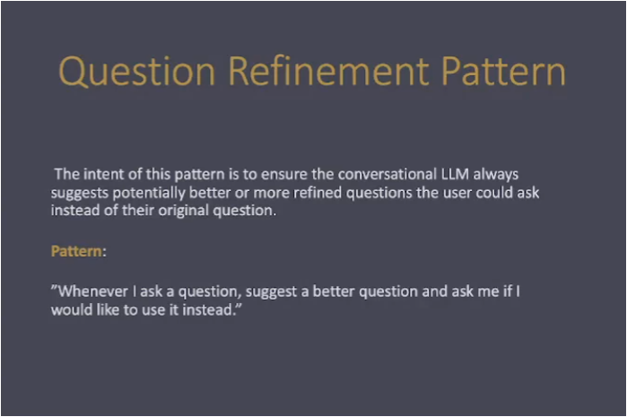
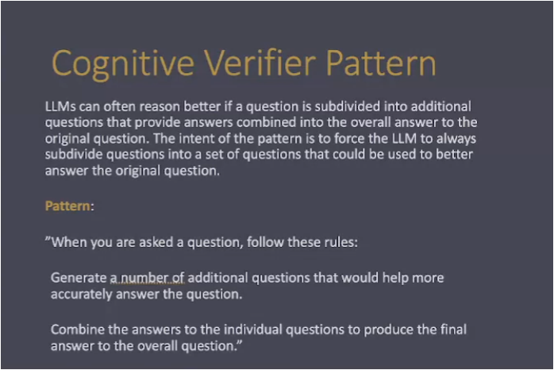
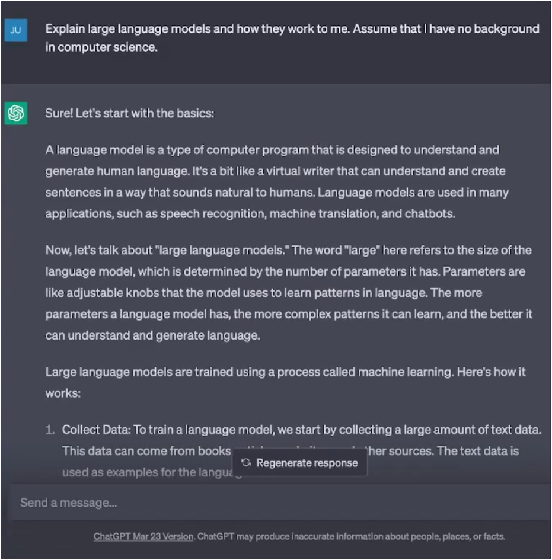
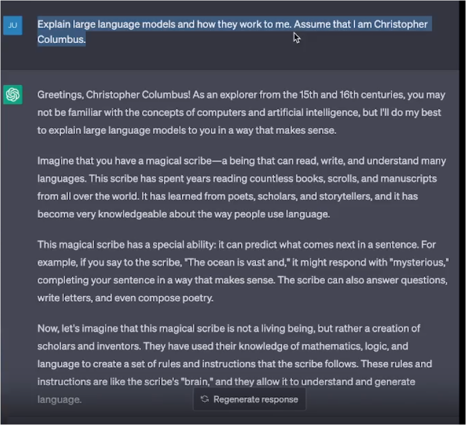
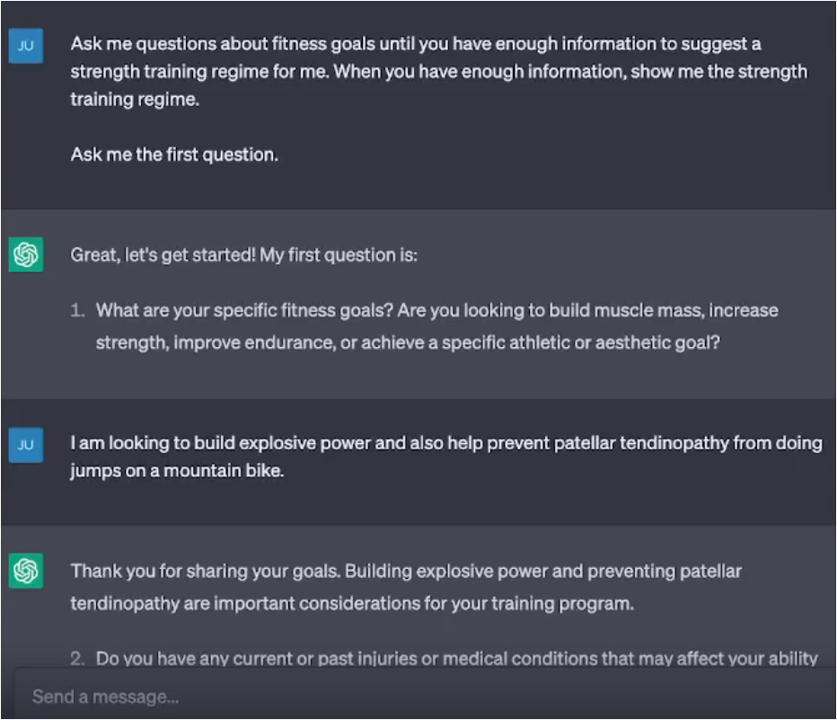

# Introduction to Prompt Patterns

## Question Refinement Pattern

### Format of the Question Refinement Pattern
To use this pattern, your prompt should make the following fundamental contextual statements:
```
From now on, whenever I ask a question, suggest a better version of the question to use instead 
(Optional) Prompt me if I would like to use the better version instead
```

Examples:
```
From now on, whenever I ask a question, suggest a better version of the question to use instead
From now on, whenever I ask a question, suggest a better version of the question and ask me if I would like to use it instead
```

Tailored Examples:
```
Whenever I ask a question about dieting, suggest a better version of the question that emphasizes healthy eating habits and sound nutrition. Ask me for the first question to refine.
Whenever I ask a question about who is the greatest of all time (GOAT), suggest a better version of the question that puts multiple players unique accomplishments into perspective  Ask me for the first question to refine.
```
### Trading Question Example
Whenever I ask a question about trading, suggest a better version of the question that emphasizes disciplined momentum trading and sound risk management. Ask me for the first question to refine.


## Cognitive Verifier Pattern

### Format of the Cognitive Verifier Pattern
To use the Cognitive Verifier Pattern, your prompt should make the following fundamental contextual statements:
```
When you are asked a question, follow these rules 
Generate a number of additional questions that would help more accurately answer the question 
Combine the answers to the individual questions to produce the final answer to the overall question
```

Examples:
```
When you are asked a question, follow these rules. Generate a number of additional questions that would help you more accurately answer the question. Combine the answers to the individual questions to produce the final answer to the overall question.
```
Tailored Examples:
```
When you are asked to create a recipe, follow these rules. Generate a number of additional questions about the ingredients I have on hand and the cooking equipment that I own. Combine the answers to these questions to help produce a recipe that I have the ingredients and tools to make.

When you are asked to plan a trip, follow these rules. Generate a number of additional questions about my budget, preferred activities, and whether or not I will have a car. Combine the answers to these questions to better plan my itinerary. 
```
### Trading Question Example
When you are asked a question, follow these rules. Generate a number of additional questions about the question I ask that would help us more accurately answer the question. Combine the answers to the individual questions to produce the final answer to the overall question.


## Audience Persona Pattern


### Format of the Audience Persona Pattern
To use this pattern, your prompt should make the following fundamental contextual statements:
```
Explain X to me. 
Assume that I am Persona Y.
```
You will need to replace "Y" with an appropriate persona, such as "have limited background in computer science" or "a healthcare expert". You will then need to specify the topic X that should be explained.

Examples:
```
Explain large language models to me. Assume that I am a bird. 
Explain how the supply chains for US grocery stores work to me. Assume that I am Ghengis Khan. 
```


## Flipped Interaction Pattern


### Format of the Flipped Interaction Pattern
To use this pattern, your prompt should make the following fundamental contextual statements:
```
I would like you to ask me questions to achieve X 
You should ask questions until condition Y is met or to achieve this goal (alternatively, forever) 
(Optional) ask me the questions one at a time, two at a time, ask me the first question, etc.
```
You will need to replace "X" with an appropriate goal, such as "creating a meal plan" or "creating variations of my marketing materials." You should specify when to stop asking questions with Y. Examples are "until you have sufficient information about my audience and goals" or "until you know what I like to eat and my caloric targets."

Examples:
```
I would like you to ask me questions to help me create variations of my marketing materials.  You should ask questions until you have sufficient information about my current draft messages, audience, and goals. Ask me the first question.

I would like you to ask me questions to help me diagnose a problem with my Internet. Ask me questions until you have enough information to identify the two most likely causes. Ask me one question at a time. Ask me the first question. 
```


# End of Module Review
## How is this impactful?


## Moving forward/How can I apply this to my workflow? 


# Translation to Trading Notes
1) Intent and Context:
2) Motivation: 
3) Structure and Key Ideas:
4) Example Implementation:
5) Consequences:


Risk Manager Assessment
Senior Trading Desk Trader Assessment
[Insert Scenario]

## Act as / Fundamental Contextual Statements
Risk Manager
Senior Trading Desk Trader
Senior Algorithmic Trader


## Game Prompt, Persona Prompt, Persona Prompt, Question Refinement
```
Example Implementation: We are going to play a futures trading game within the technical analysis aspect. You are going to pretend to be a consistently profitable senior futures trader at a porp firm. When I give you chart, you are going to conduct a technical analysis with the goal of identifying key level and noteworthy price action. You will take all of your analysis and produce a complete assessment to include a trading plan.

From now on, you are a more senior trader than me. Provide guidance using outputs that a senior futures trader would regarding my actions or inputs. IF you spot areas where I can improve on my questions, THEN suggest a better version of the question to use that incorporates information specific to what you deem as appropriate trading strategies and risk management. Ask me if I would like to use your question instead.
```

## Flipped Interaction Pattern
Meh 1st iteration
```
Ask me questions about Trading Psychology goals until you have enough information to suggest a psychological training regiment for me. When you have enough information, show me the psychological training regime.

Ask me the first question.
```

## Question Refinement Pattern
```
Whenever I ask a question about trading, suggest a better version of the question that emphasizes disciplined momentum trading and sound risk management. Ask me for the first question to refine.
```

## Cognitive Verifier Pattern
When you are asked a question, follow these rules. Generate a number of additional questions about the question I ask that would help us more accurately answer the question. Combine the answers to the individual questions to produce the final answer to the overall question.