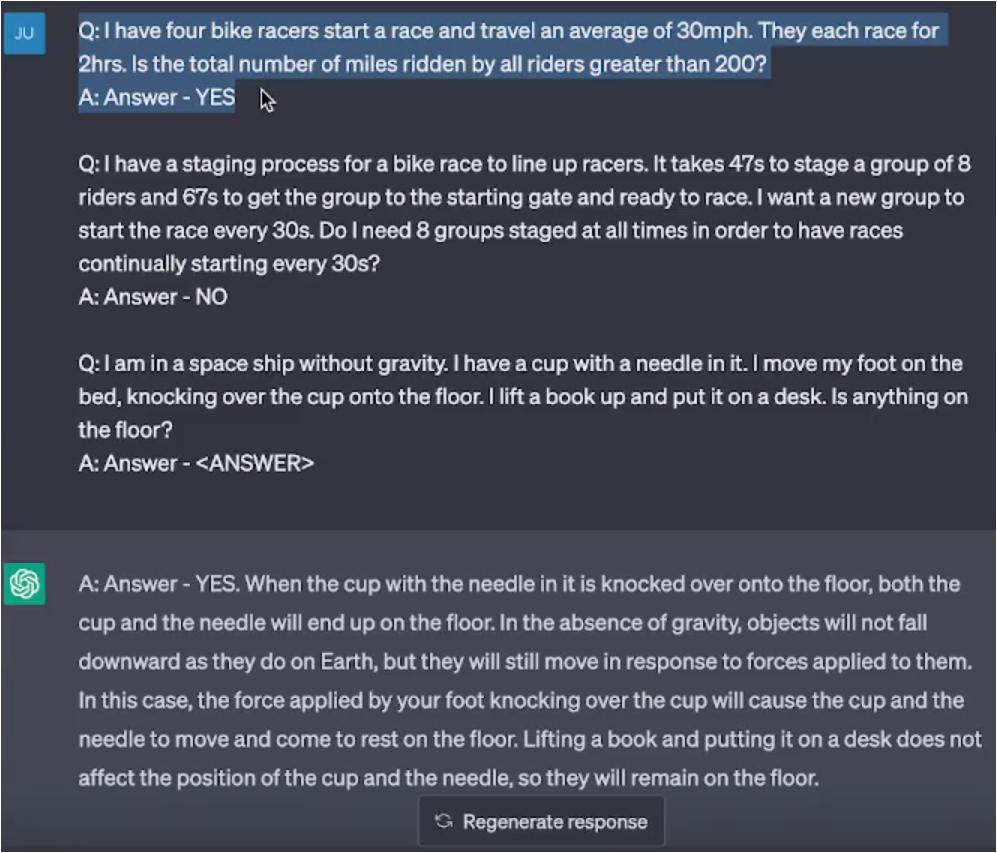

# Effective Prompts

## Few-shot Examples
Actually within our prompt, we're teaching the large language model a new trick. We're basically showing it what we want it to do and how we want it to format the output within a series of examples. Rather than describing the process we want it to follow, we're giving it examples of what we want it to do and then hoping that it will continue the pattern that we provide. 


### Few-shot Examples for Actions


### Few-Shot Examples with Intermediate Steps


### Writing Effective Few-Shot Examples
N/A


## Chain of Thought Prompting

### Example of NOT a Chain of Thought Prompting


### Example of Chain of Thought Prompting


## Learn More About Chain of Thought Prompting
https://arxiv.org/abs/2201.11903


## ReAct Prompts


### Learn More About ReAct
https://arxiv.org/abs/2210.03629


# Applying Few-Shot Examples Concepts


# End of Module Review
## How is this impactful?


## Moving forward/How can I apply this to my workflow? 


# Translation to Trading Notes
1) Intent and Context:
2) Motivation: 
3) Structure and Key Ideas:
4) Example Implementation:
5) Consequences:


Risk Manager Assessment
Senior Trading Desk Trader Assessment
[Insert Scenario]

## Act as / Fundamental Contextual Statements
Risk Manager
Senior Trading Desk Trader
Senior Algorithmic Trader


## Game Prompt, Persona Prompt, Persona Prompt, Question Refinement
```
Example Implementation: We are going to play a futures trading game within the technical analysis aspect. You are going to pretend to be a consistently profitable senior futures trader at a porp firm. When I give you chart, you are going to conduct a technical analysis with the goal of identifying key level and noteworthy price action. You will take all of your analysis and produce a complete assessment to include a trading plan.

From now on, you are a more senior trader than me. Provide guidance using outputs that a senior futures trader would regarding my actions or inputs. IF you spot areas where I can improve on my questions, THEN suggest a better version of the question to use that incorporates information specific to what you deem as appropriate trading strategies and risk management. Ask me if I would like to use your question instead.
```

## Flipped Interaction Pattern
Meh 1st iteration
```
Ask me questions about Trading Psychology goals until you have enough information to suggest a psychological training regiment for me. When you have enough information, show me the psychological training regime.

Ask me the first question.
```

## Question Refinement Pattern
```
Whenever I ask a question about trading, suggest a better version of the question that emphasizes disciplined momentum trading and sound risk management. Ask me for the first question to refine.
```

## Cognitive Verifier Pattern
When you are asked a question, follow these rules. Generate a number of additional questions about the question I ask that would help us more accurately answer the question. Combine the answers to the individual questions to produce the final answer to the overall question.