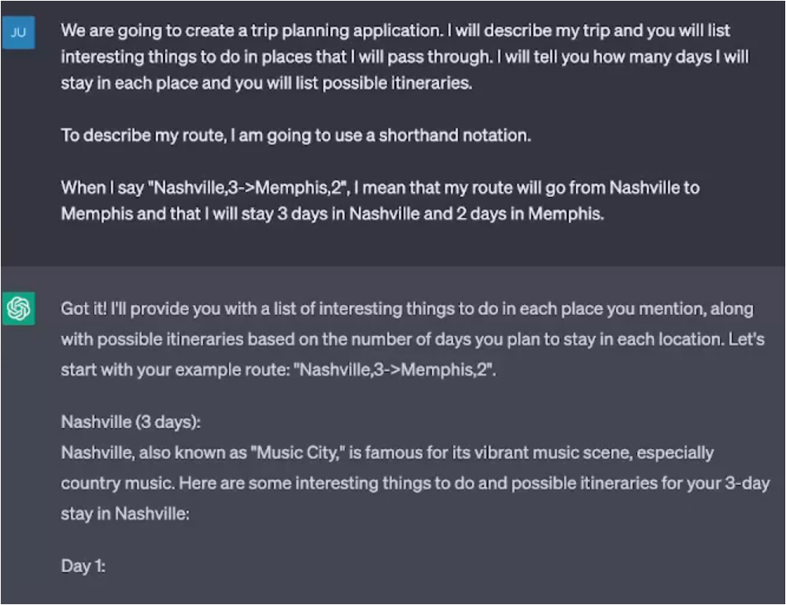

# Prompt Patterns Catalog

## Video: Game Play Pattern


## Video: Template Pattern


### Format of the Template Pattern
To use this pattern, your prompt should make the following fundamental contextual statements:
- I am going to provide a template for your output 
- X is my placeholder for content 
- Try to fit the output into one or more of the placeholders that I list 
- Please preserve the formatting and overall template that I provide 
- This is the template: PATTERN with PLACEHOLDERS

You will need to replace "X" with an appropriate placeholder, such as "CAPITALIZED WORDS" or "<PLACEHOLDER>". You will then need to specify a pattern to fill in, such as "Dear <FULL NAME>" or "NAME, TITLE, COMPANY".

Examples:
```
Create a random strength workout for me today with complementary exercises. I am going to provide a template for your output . CAPITALIZED WORDS are my placeholders for content. Try to fit the output into one or more of the placeholders that I list. Please preserve the formatting and overall template that I provide. This is the template: NAME, REPS @ SETS, MUSCLE GROUPS WORKED, DIFFICULTY SCALE 1-5, FORM NOTES
```
```
Please create a grocery list for me to cook macaroni and cheese from scratch, garlic bread, and marinara sauce from scratch. I am going to provide a template for your output . <placeholder> are my placeholders for content. Try to fit the output into one or more of the placeholders that I list. Please preserve the formatting and overall template that I provide.   

This is the template:   
Aisle <name of aisle>: 
<item needed from aisle>, <qty> (<dish(es) used in>
```

## Video: Meta Language Creation Pattern


### Format of the Meta Language Creation Pattern
To use this pattern, your prompt should make the following fundamental contextual statements:
- When I say X, I mean Y (or would like you to do Y)

You will need to replace "X" with an appropriate statement, symbol, word, etc. You will then need to may this to a meaning, Y.

Examples:
```
When I say "variations(<something>)", I mean give me ten different variations of <something>

Usage: "variations(company names for a company that sells software services for prompt engineering)"

Usage: "variations(a marketing slogan for pickles)"
```
```
When I say Task X [Task Y], I mean Task X depends on Task Y being completed first. 

Usage: "Describe the steps for building a house using my task dependency language."

Usage: "Provide an ordering for the steps: Boil Water [Turn on Stove], Cook Pasta [Boil Water], Make Marinara [Turn on Stove], Turn on Stove [Go Into Kitchen]"
```
## Video: Recipe Pattern


### Format of the Recipe Pattern
- To use this pattern, your prompt should make the following fundamental contextual statements:
- I would like to achieve X 
- I know that I need to perform steps A,B,C 
- Provide a complete sequence of steps for me 
- Fill in any missing steps 
- (Optional) Identify any unnecessary steps

You will need to replace "X" with an appropriate task. You will then need to specify the steps A, B, C that you know need to be part of the recipe / complete plan.

Examples:
```
I would like to  purchase a house. I know that I need to perform steps make an offer and close on the house. Provide a complete sequence of steps for me. Fill in any missing steps.
```
```
I would like to drive to NYC from Nashville. I know that I want to go through Asheville, NC on the way and that I don't want to drive more than 300 miles per day. Provide a complete sequence of steps for me. Fill in any missing steps.
```
## Video: Alternative Approaches Pattern


### Format of the Alternative Approaches Pattern
To use this pattern, your prompt should make the following fundamental contextual statements:
- If there are alternative ways to accomplish a task X that I give you, list the best alternate approaches 
- (Optional) compare/contrast the pros and cons of each approach 
- (Optional) include the original way that I asked 
- (Optional) prompt me for which approach I would like to use

You will need to replace "X" with an appropriate task.

Examples:
```
For every prompt I give you, If there are alternative ways to word a prompt that I give you, list the best alternate wordings . Compare/contrast the pros and cons of each wording. 
```
```
For anything that I ask you to write, determine the underlying problem that I am trying to solve and how I am trying to solve it. List at least one alternative approach to solve the problem and compare / contrast the approach with the original approach implied by my request to you.
```


# End of Module Review
## How is this impactful?


## Moving forward/How can I apply this to my workflow? 


# Translation to Trading Notes
1) Intent and Context:
2) Motivation: 
3) Structure and Key Ideas:
4) Example Implementation:
5) Consequences:


Risk Manager Assessment
Senior Trading Desk Trader Assessment
[Insert Scenario]

## Act as / Fundamental Contextual Statements
Risk Manager
Senior Trading Desk Trader
Senior Algorithmic Trader


## Game Prompt, Persona Prompt, Persona Prompt, Question Refinement
```
Example Implementation: We are going to play a futures trading game within the technical analysis aspect. You are going to pretend to be a consistently profitable senior futures trader at a porp firm. When I give you chart, you are going to conduct a technical analysis with the goal of identifying key level and noteworthy price action. You will take all of your analysis and produce a complete assessment to include a trading plan.

From now on, you are a more senior trader than me. Provide guidance using outputs that a senior futures trader would regarding my actions or inputs. IF you spot areas where I can improve on my questions, THEN suggest a better version of the question to use that incorporates information specific to what you deem as appropriate trading strategies and risk management. Ask me if I would like to use your question instead.
```

## Flipped Interaction Pattern
Meh 1st iteration
```
Ask me questions about Trading Psychology goals until you have enough information to suggest a psychological training regiment for me. When you have enough information, show me the psychological training regime.

Ask me the first question.
```

## Question Refinement Pattern
```
Whenever I ask a question about trading, suggest a better version of the question that emphasizes disciplined momentum trading and sound risk management. Ask me for the first question to refine.
```

## Cognitive Verifier Pattern
When you are asked a question, follow these rules. Generate a number of additional questions about the question I ask that would help us more accurately answer the question. Combine the answers to the individual questions to produce the final answer to the overall question.


## LASCON Prompt Engineering Challenges:
```
We are going to play a game involving prompt engineering. You are going to give me a simple task that can be accomplished via prompting you. Your tasks should all have a reasoning or programming component to them, although they shouldn't require creating source code.

I will try to write a prompt for you to solve the task. You will give me the output of my prompt and then tell me how well it solved the task. Ask me questions until I tell you to stop. You will ask me a question, wait for my response, and then ask me another question after telling me how I did.

Ask me the first question.

```


