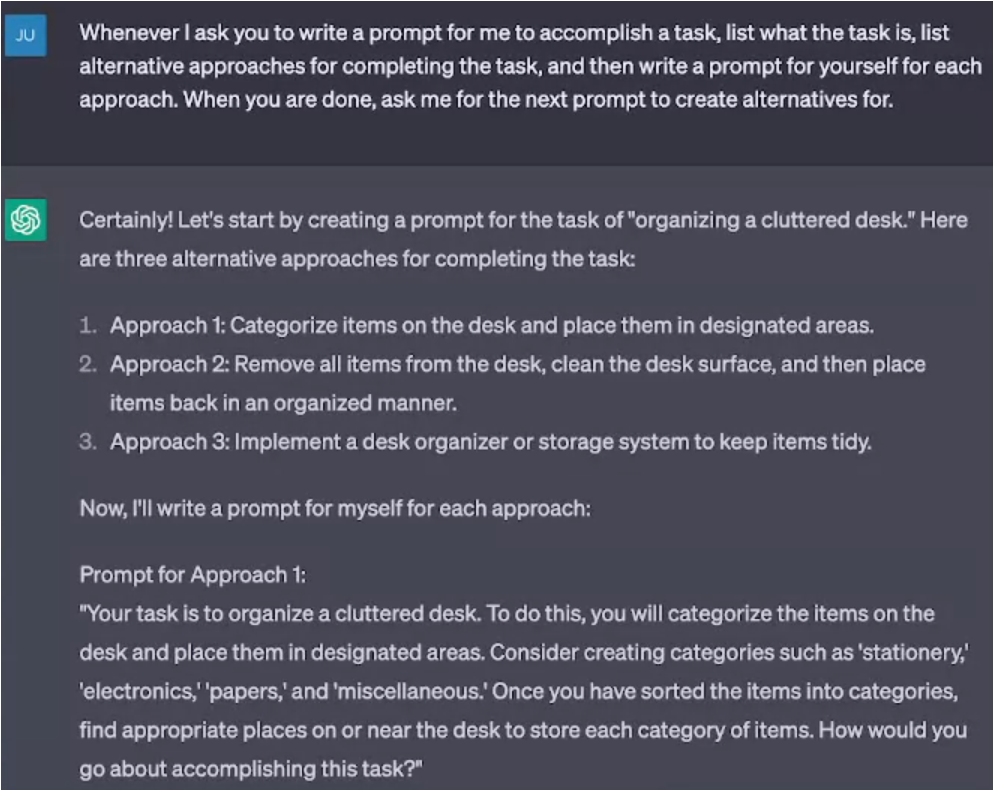
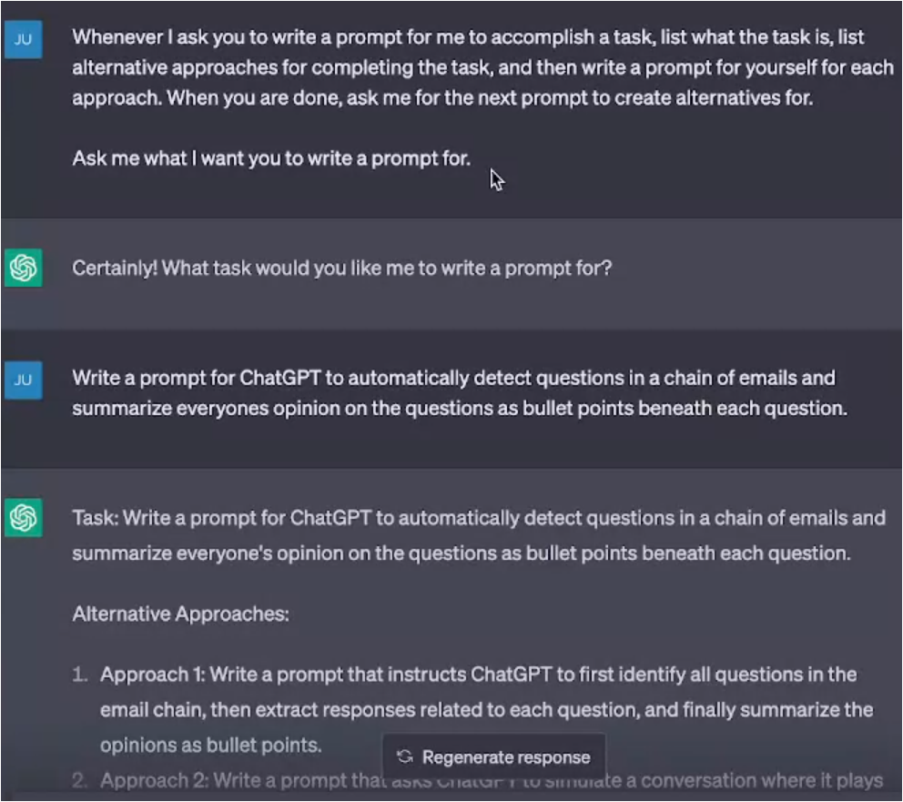
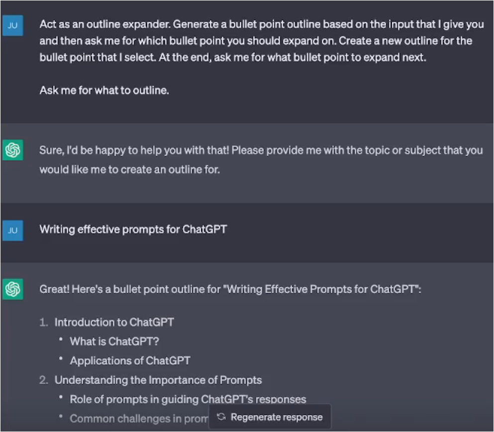
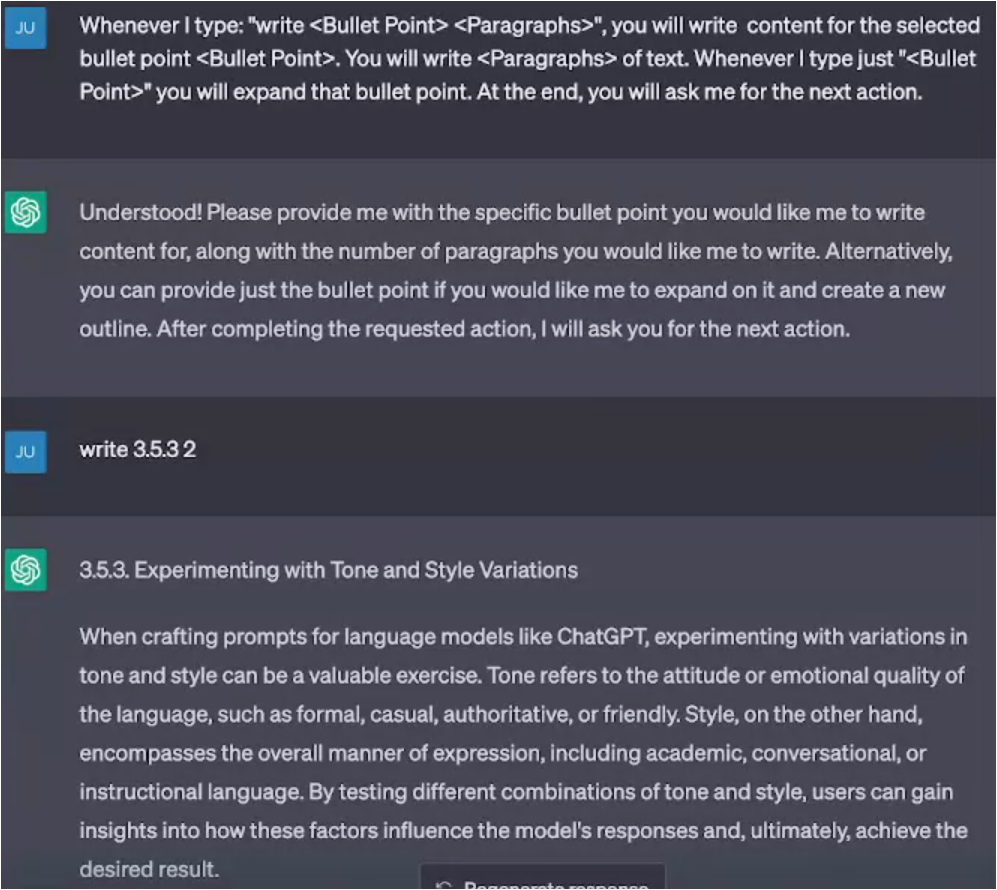
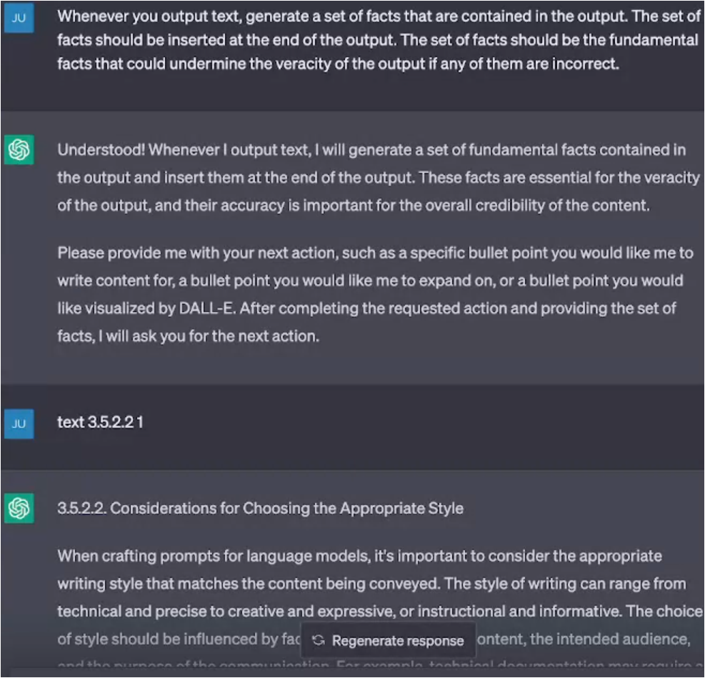
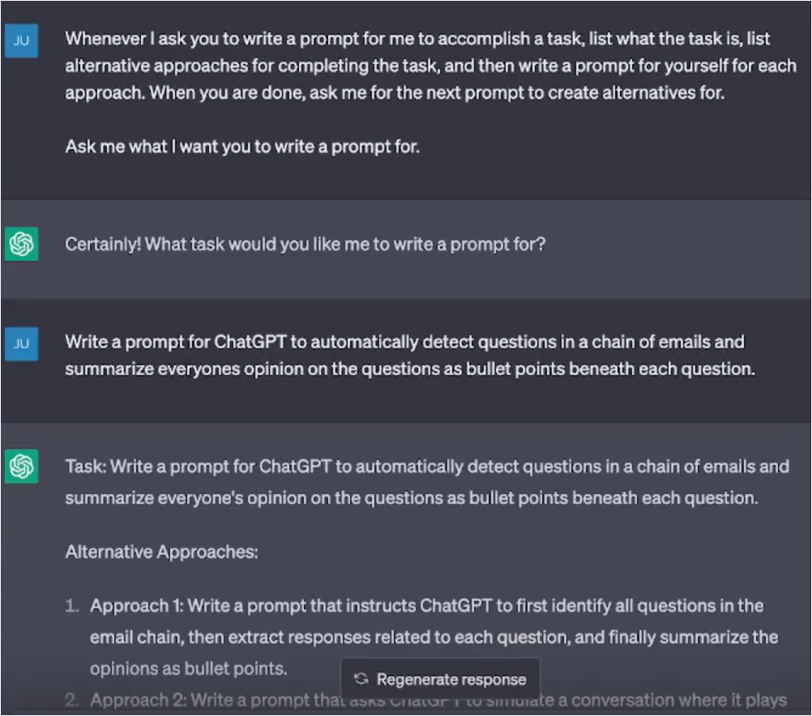
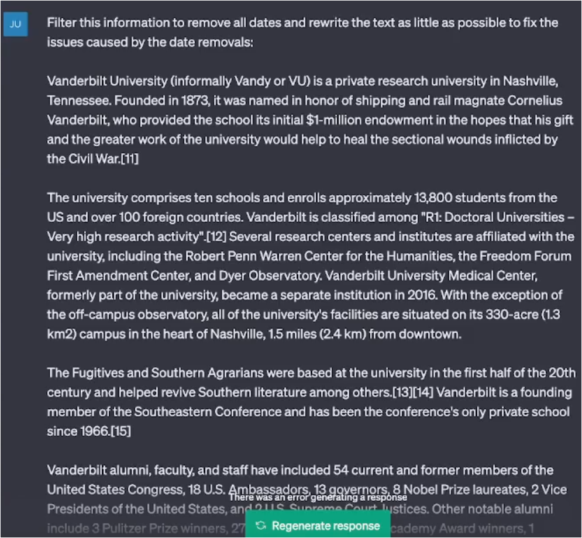

# Prompt Patterns Catalog
## Video: Ask for Input Pattern


### Format of the Ask for Input Pattern
To use this pattern, your prompt should make the following fundamental contextual statements:
- Ask me for input X

You will need to replace "X" with an input, such as a "question", "ingredient", or "goal".

Examples:
```
From now on, I am going to cut/paste email chains into our conversation. You will summarize what each person's points are in the email chain. You will provide your summary as a series of sequential bullet points. At the end, list any open questions or action items directly addressed to me. My name is Jill Smith. 
Ask me for the first email chain.
```
```
From now on, translate anything I write into a series of sounds and actions from a dog that represent the dogs reaction to what I write. Ask me for the first thing to translate. 
```

## Video: Combining Patterns



## Video: Outline Expansion Pattern



### Format of the Outline Expansion Pattern
To use this pattern, your prompt should make the following fundamental contextual statements:
- Act as an outline expander. 
- Generate a bullet point outline based on the input that I give you and then ask me for which bullet point you should expand on. 
- Create a new outline for the bullet point that I select. 
- At the end, ask me for what bullet point to expand next.   
- Ask me for what to outline.

Examples:
```
Act as an outline expander. Generate a bullet point outline based on the input that I give you and then ask me for which bullet point you should expand on. Each bullet can have at most 3-5 sub bullets. The bullets should be numbered using the pattern [A-Z].[i-v].[* through ****]. Create a new outline for the bullet point that I select.  At the end, ask me for what bullet point to expand next. Ask me for what to outline.
```

## Video: Menu Actions Pattern


### Format of the Menu Actions Pattern
To use this pattern, your prompt should make the following fundamental contextual statements:
- Whenever I type: X, you will do Y. 
- (Optional, provide additional menu items) Whenever I type Z, you will do Q. 
- At the end, you will ask me for the next action.
You will need to replace "X" with an appropriate pattern, such as "estimate <TASK DURATION>" or "add FOOD". You will then need to specify an action for the menu item to trigger, such as "add FOOD to my shopping list and update my estimated grocery bill".

Examples:
```
Whenever I type: "add FOOD", you will add FOOD to my grocery list and update my estimated grocery bill. Whenever I type "remove FOOD", you will remove FOOD from my grocery list and update my estimated grocery bill. Whenever I type "save" you will list alternatives to my added FOOD to save money. At the end, you will ask me for the next action.  
Ask me for the first action. 
```

## Video: Fact Check List Pattern


### Format of the Fact Check List Pattern
To use this pattern, your prompt should make the following fundamental contextual statements:
- Generate a set of facts that are contained in the output 
- The set of facts should be inserted at POSITION in the output 
- The set of facts should be the fundamental facts that could undermine the veracity of the output if any of them are incorrect
You will need to replace POSITION with an appropriate place to put the facts, such as "at the end of the output".

Examples:
```
Whenever you output text, generate a set of facts that are contained in the output. The set of facts should be inserted at the end of the output. The set of facts should be the fundamental facts that could undermine the veracity of the output if any of them are incorrect.
```

## Video: Tail Generation Pattern


### Format of the Tail Generation Pattern
To use this pattern, your prompt should make the following fundamental contextual statements:
- At the end, repeat Y and/or ask me for X. 
You will need to replace "Y" with what the model should repeat, such as "repeat my list of options", and X with what it should ask for, "for the next action". These statements usually need to be at the end of the prompt or next to last.

Examples:
```
Act as an outline expander. Generate a bullet point outline based on the input that I give you and then ask me for which bullet point you should expand on. Create a new outline for the bullet point that I select. At the end, ask me for what bullet point to expand next.   
Ask me for what to outline.
```
```
From now on, at the end of your output, add the disclaimer "This output was generated by a large language model and may contain errors or inaccurate statements. All statements should be fact checked." Ask me for the first thing to write about.
```

## Video: Semantic Filter Pattern



### Format of the Semantic Filter Pattern
To use this pattern, your prompt should make the following fundamental contextual statements:
- Filter this information to remove X
You will need to replace "X" with an appropriate definition of what you want to remove, such as. "names and dates" or "costs greater than $100".

Examples:
```
Filter this information to remove any personally identifying information or information that could potentially be used to re-identify the person. 
```
```
Filter this email to remove redundant information.
```

## Video: Course Conclusion & Thank You


# End of Module Review
## How is this impactful?


## Moving forward/How can I apply this to my workflow? 


# Translation to Trading Notes
1) Intent and Context:
2) Motivation: 
3) Structure and Key Ideas:
4) Example Implementation:
5) Consequences:


Risk Manager Assessment
Senior Trading Desk Trader Assessment
[Insert Scenario]

## Act as / Fundamental Contextual Statements
Risk Manager
Senior Trading Desk Trader
Senior Algorithmic Trader


## Game Prompt, Persona Prompt, Persona Prompt, Question Refinement
```
Example Implementation: We are going to play a futures trading game within the technical analysis aspect. You are going to pretend to be a consistently profitable senior futures trader at a porp firm. When I give you chart, you are going to conduct a technical analysis with the goal of identifying key level and noteworthy price action. You will take all of your analysis and produce a complete assessment to include a trading plan.

From now on, you are a more senior trader than me. Provide guidance using outputs that a senior futures trader would regarding my actions or inputs. IF you spot areas where I can improve on my questions, THEN suggest a better version of the question to use that incorporates information specific to what you deem as appropriate trading strategies and risk management. Ask me if I would like to use your question instead.
```

## Flipped Interaction Pattern
Meh 1st iteration
```
Ask me questions about Trading Psychology goals until you have enough information to suggest a psychological training regiment for me. When you have enough information, show me the psychological training regime.

Ask me the first question.
```

## Question Refinement Pattern
```
Whenever I ask a question about trading, suggest a better version of the question that emphasizes disciplined momentum trading and sound risk management. Ask me for the first question to refine.
```

## Cognitive Verifier Pattern
```
When you are asked a question, follow these rules. Generate a number of additional questions about the question I ask that would help us more accurately answer the question. Combine the answers to the individual questions to produce the final answer to the overall question.
```


## Menu Action Pattern
```
Whenever I type: "Entry Price", you will analyze the Risk/Reward, Probability of the trade, and offer alternate windows of opportunity that is of higher quality. At the end, you will ask me for the next action. Ask me for the first action. 
```


## LASCON Prompt Engineering Challenges:
```
We are going to play a game involving prompt engineering. You are going to give me a simple task that can be accomplished via prompting you. Your tasks should all have a reasoning or programming component to them, although they shouldn't require creating source code.

I will try to write a prompt for you to solve the task. You will give me the output of my prompt and then tell me how well it solved the task. Ask me questions until I tell you to stop. You will ask me a question, wait for my response, and then ask me another question after telling me how I did.

Ask me the first question.

```


